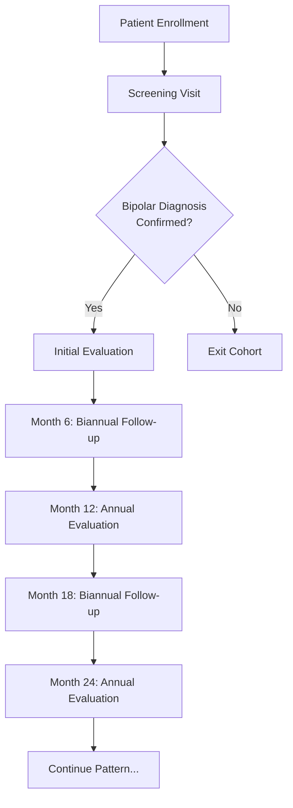

# eFondaMental Visits System - Technical & Clinical Documentation

**Version**: 1.0  
**Last Updated**: January 2026  
**Platform**: eFondaMental Bipolar Disorder Assessment System

---

## Table of Contents

1. [Introduction & System Architecture](#1-introduction--system-architecture)
2. [Visit Types Overview](#2-visit-types-overview)
3. [Screening Visit](#3-screening-visit)
4. [Initial Evaluation Visit](#4-initial-evaluation-visit)
5. [Biannual Follow-up Visit](#5-biannual-follow-up-visit)
6. [Annual Evaluation Visit](#6-annual-evaluation-visit)
7. [Questionnaires Catalog](#7-questionnaires-catalog)
8. [Specialized Scoring Systems](#8-specialized-scoring-systems)
9. [Longitudinal Follow-up Architecture](#9-longitudinal-follow-up-architecture)
10. [Technical Implementation](#10-technical-implementation)

---

## 1. Introduction & System Architecture

### 1.1 Platform Overview

eFondaMental is a comprehensive digital platform designed for longitudinal assessment and monitoring of bipolar disorder. The system implements evidence-based psychiatric evaluation protocols, combining self-reported questionnaires with clinician-administered assessments to provide holistic patient care.

### 1.2 Core Design Principles

- **Modular Architecture**: Each visit is composed of modules grouping related assessments
- **Role-Based Access**: Questionnaires are targeted to specific roles (patient vs healthcare professional)
- **Longitudinal Tracking**: Key questionnaires are reused across visits to track symptom evolution
- **Standardized Scoring**: Implements validated scoring algorithms with age/education normalization

### 1.3 Key Concepts

**Visit**: A scheduled clinical encounter with a defined set of assessments  
**Module**: A logical grouping of related questionnaires within a visit  
**Questionnaire**: An individual assessment instrument (scales, tests, evaluations)  
**Longitudinal Follow-up**: Systematic reuse of questionnaires to track changes over time

---

## 2. Visit Types Overview

The platform supports four distinct visit types, each serving a specific clinical purpose:

| Visit Type | Code | Frequency | Total Questionnaires | Total Modules | Unique Constraint |
|------------|------|-----------|---------------------|---------------|-------------------|
| **Screening** | `screening` | Once | 5 | 2 | Yes |
| **Initial Evaluation** | `initial_evaluation` | Once | 55 | 7 | Yes |
| **Biannual Follow-up** | `biannual_followup` | Every 6 months | 25 | 3 | No |
| **Annual Evaluation** | `annual_evaluation` | Every 12 months | 48 | 5 | No |

### 2.1 Visit Flow Diagram



### 2.2 Unique Visit Constraints

**Screening** and **Initial Evaluation** can only exist once per patient (non-cancelled). This constraint is enforced at the service layer to ensure baseline assessment integrity.

```typescript
// Only these visit types have uniqueness constraints
const UNIQUE_VISIT_TYPES = ['screening', 'initial_evaluation'];
```

---

## 3. Screening Visit

**Purpose**: Initial triage and diagnostic screening for bipolar disorder  
**Duration**: 15-30 minutes  
**Modules**: 2  
**Total Questionnaires**: 5

### 3.1 Module Structure

#### Module 1: Autoquestionnaires (Patient Self-Report)
**Module ID**: `mod_auto`  
**Target Role**: Patient  
**Questionnaires**: 3

1. **ASRM** (Altman Self-Rating Mania Scale)
2. **QIDS-SR16** (Quick Inventory of Depressive Symptomatology)
3. **MDQ** (Mood Disorder Questionnaire)

#### Module 2: Partie médicale (Medical Assessment)
**Module ID**: `mod_medical`  
**Target Role**: Healthcare Professional  
**Questionnaires**: 2

1. **Diagnostic** (Medical Diagnostic Assessment)
2. **Orientation** (Patient Orientation Decision)

### 3.2 Questionnaire Details

#### 3.2.1 ASRM (Altman Self-Rating Mania Scale)

**Code**: `ASRM_FR`  
**Items**: 5  
**Response Scale**: 0-4 (5-point Likert scale)  
**Score Range**: 0-20

**Questions**:


1. **Q1**: "How are your spirits feeling today?"
   - 0: Not at all or less happy or sad than usual
   - 1: Somewhat more cheerful than usual
   - 2: More cheerful than usual
   - 3: Very cheerful most of the time
   - 4: Extremely cheerful, overjoyed or on top of the world throughout the day

2. **Q2**: "How self-confident are you today?"
   - 0: Not at all or less confident than usual
   - 1: Somewhat more self-confident than usual
   - 2: More self-confident than usual
   - 3: Very self-confident or sure of themselves most of the time
   - 4: Extremely self-confident or completely sure of themselves all the time

3. **Q3**: "How much sleep do you need?"
   - 0: More than usual or about as much as usual
   - 1: A little less than usual
   - 2: Less than usual
   - 3: Much less than usual
   - 4: Need very little sleep or no sleep at all

4. **Q4**: "How talkative are you?"
   - 0: Not at all or about as talkative as usual
   - 1: A little more talkative than usual
   - 2: More talkative than usual
   - 3: Much more talkative than usual most of the time
   - 4: Talking constantly, can't be interrupted

5. **Q5**: "How active are you?"
   - 0: Not at all or about as active as usual
   - 1: A little more active than usual
   - 2: More active than usual
   - 3: Much more active than usual most of the time
   - 4: Constantly active or on the go all the time

**Scoring**:
```
Total Score = Q1 + Q2 + Q3 + Q4 + Q5
```

**Interpretation**:
- **0-5**: No manic symptoms
- **6-10**: Mild manic symptoms (monitor)
- **11-15**: Moderate manic symptoms (clinical attention recommended)
- **16-20**: Severe manic symptoms (urgent clinical attention)

**Database Table**: `responses_asrm`

---

#### 3.2.2 QIDS-SR16 (Quick Inventory of Depressive Symptomatology)

**Code**: `QIDS_SR16_FR`  
**Items**: 16  
**Response Scale**: 0-3 (4-point scale)  
**Score Range**: 0-27 (special scoring rules apply)

**Scoring Method**: The QIDS uses a unique scoring system where only the highest score from groups of related questions is counted:

- **Sleep questions (Q1-Q4)**: Count only the highest score from these 4 items
- **Appetite/Weight questions (Q6-Q9)**: Count only the highest score from these 4 items
- **Psychomotor questions (Q15-Q16)**: Count only the highest score from these 2 items
- **Individual questions**: Q5, Q10, Q11, Q12, Q13, Q14 are scored individually

**Score Calculation**:
```
Total = max(Q1,Q2,Q3,Q4) + Q5 + max(Q6,Q7,Q8,Q9) + Q10 + Q11 + Q12 + Q13 + Q14 + max(Q15,Q16)
Range: 0-27
```

**Interpretation**:
- **0-5**: No depression
- **6-10**: Mild depression
- **11-15**: Moderate depression
- **16-20**: Severe depression
- **21-27**: Very severe depression

**Database Table**: `responses_qids_sr16`

---

#### 3.2.3 MDQ (Mood Disorder Questionnaire)

**Code**: `MDQ_FR`  
**Items**: 13 questions + 2 follow-up questions  
**Response Scale**: Yes/No for Q1-Q13; Multiple choice for follow-ups

**Structure**:
- **Q1-Q13**: Lifetime occurrence of manic/hypomanic symptoms (Yes/No)
- **Q14**: Did symptoms occur together? (Yes/No)
- **Q15**: Problem severity (No problem / Minor problem / Moderate problem / Serious problem)

**Scoring**:
```
Total Yes Count = Sum of "Yes" answers in Q1-Q13
Range: 0-13
```

**Screening Positive Criteria** (ALL must be met):
1. 7 or more "Yes" answers (Q1-Q13)
2. Q14 = "Yes" (symptoms occurred together)
3. Q15 = "Moderate problem" OR "Serious problem"

**Interpretation**:
- **Positive Screen**: Suggests possible bipolar disorder → Refer for comprehensive evaluation
- **Negative Screen**: Bipolar disorder less likely, but clinical judgment applies

**Database Table**: `responses_mdq`

---

#### 3.2.4 Diagnostic (Medical Diagnostic Assessment)

**Code**: `DIAGNOSTIC`  
**Type**: Clinician-administered structured interview  
**Purpose**: Comprehensive diagnostic formulation

**Key Components**:
1. Primary psychiatric diagnosis
2. Comorbid conditions
3. Onset age
4. Episode characteristics
5. Treatment history
6. Family history

**Database Table**: `responses_medical_diagnostic`

---

#### 3.2.5 Orientation (Patient Orientation Decision)

**Code**: `ORIENTATION`  
**Type**: Clinical decision tool  
**Purpose**: Determine next steps in care pathway

**Possible Outcomes**:
- Continue to Initial Evaluation (bipolar diagnosis confirmed)
- Refer to alternative service
- Exit cohort (exclusion criteria met)

**Database Table**: `responses_bipolar_orientation`

---

## 4. Initial Evaluation Visit

**Purpose**: Comprehensive baseline assessment establishing patient profile  
**Duration**: 3-4 hours (can be split across multiple sessions)  
**Modules**: 7  
**Total Questionnaires**: 55

### 4.1 Module Structure

| Module ID | Module Name | Questionnaires | Target Role |
|-----------|-------------|----------------|-------------|
| `mod_nurse` | Infirmier | 6 | Healthcare Professional |
| `mod_thymic_eval` | Evaluation état thymique et fonctionnement | 7 | Healthcare Professional |
| `mod_medical_eval` | Evaluation Médicale | 19 | Healthcare Professional |
| `mod_neuropsy` | Evaluation Neuropsychologique | 5 + sections | Healthcare Professional |
| `mod_auto_etat` | Autoquestionnaires - ETAT | 9 | Patient |
| `mod_social` | Social | 1 | Healthcare Professional |
| `mod_auto_traits` | Autoquestionnaires - TRAITS | 9 | Patient |

### 4.2 Module 1: Infirmier (Nurse Assessment)

**Module ID**: `mod_nurse`  
**Purpose**: Physical health parameters and substance use assessment  
**Questionnaires**: 6

1. **TOBACCO** - Smoking status and history
2. **FAGERSTROM** - Nicotine dependence (conditional on current smoker status)
3. **PHYSICAL_PARAMS** - Height, weight, BMI, abdominal circumference
4. **BLOOD_PRESSURE** - BP and heart rate (lying/standing)
5. **SLEEP_APNEA** - STOP-Bang screening
6. **BIOLOGICAL_ASSESSMENT** - Comprehensive blood work results

#### 4.2.1 TOBACCO Assessment

**Code**: `TOBACCO`  
**Questions**: Variable (conditional logic)

**Q1**: "Tobacco Status"
- Non-smoker
- Current smoker → **Additional fields**: pack-years, age started, substitution methods
- Ex-smoker → **Additional fields**: pack-years, ages started/stopped, past substitution

**Database Table**: `responses_tobacco`

---

#### 4.2.2 FAGERSTROM Test for Nicotine Dependence

**Code**: `FAGERSTROM`  
**Items**: 6  
**Conditional**: Only shown if TOBACCO status = "Current smoker"

**Questions & Scoring**:

1. **Q1**: "How soon after waking do you smoke your first cigarette?"
   - Within 5 minutes = 3
   - 6-30 minutes = 2
   - 31-60 minutes = 1
   - After 60 minutes = 0

2. **Q2**: "Do you find it difficult to refrain from smoking in places where it's forbidden?"
   - Yes = 1
   - No = 0

3. **Q3**: "Which cigarette would you hate most to give up?"
   - The first one = 1
   - Any other = 0

4. **Q4**: "How many cigarettes per day do you smoke?"
   - 10 or less = 0
   - 11-20 = 1
   - 21-30 = 2
   - 31 or more = 3

5. **Q5**: "Do you smoke more frequently in the morning?"
   - Yes = 1
   - No = 0

6. **Q6**: "Do you smoke when you are so ill that you are in bed most of the day?"
   - Yes = 1
   - No = 0

**Scoring**:
```
Total = Q1 + Q2 + Q3 + Q4 + Q5 + Q6
Range: 0-10
```

**Interpretation**:
- **0-2**: Very low dependence
- **3-4**: Low dependence
- **5**: Moderate dependence
- **6-7**: High dependence
- **8-10**: Very high dependence

**Database Table**: `responses_fagerstrom`

---

#### 4.2.3 PHYSICAL_PARAMS

**Code**: `PHYSICAL_PARAMS`  
**Measurements**: 4

1. **Height** (cm): 110-210
2. **Weight** (kg): 30-200
3. **BMI** (kg/m²): Auto-calculated = Weight / (Height/100)²
4. **Abdominal Circumference** (cm): 40-160

**Database Table**: `responses_physical_params`

---

#### 4.2.4 BLOOD_PRESSURE

**Code**: `BLOOD_PRESSURE`  
**Measurements**: 2 positions

**Lying Down**:
- Systolic BP (mmHg)
- Diastolic BP (mmHg)
- Heart Rate (bpm)

**Standing**:
- Systolic BP (mmHg)
- Diastolic BP (mmHg)
- Heart Rate (bpm)

**Clinical Significance**: Orthostatic hypotension assessment (relevant for psychotropic medication monitoring)

**Database Table**: `responses_blood_pressure`

---

#### 4.2.5 SLEEP_APNEA (STOP-Bang Questionnaire)

**Code**: `SLEEP_APNEA`  
**Purpose**: Screen for obstructive sleep apnea risk

**Initial Question**: "Have you been diagnosed with sleep apnea?"
- **Yes** → Only ask: "Do you use CPAP device?"
- **No/Unknown** → Complete STOP-Bang 8-item screening

**STOP-Bang Items** (each scores 1 point):

1. **S**noring: Do you snore loudly?
2. **T**iredness: Do you often feel tired during the day?
3. **O**bserved: Has anyone observed you stop breathing during sleep?
4. **P**ressure: Do you have or are you treated for high blood pressure?
5. **B**MI: Is your BMI > 35 kg/m²?
6. **A**ge: Are you over 50 years old?
7. **N**eck: Neck circumference > 43cm (M) or > 41cm (F)?
8. **G**ender: Male?

**Scoring**:
```
Total = Sum of Yes answers (0-8)
```

**Interpretation**:
- **0-2**: Low risk
- **3-4**: Intermediate risk
- **5-8**: High risk for OSA

**Database Table**: `responses_sleep_apnea`

---

#### 4.2.6 BIOLOGICAL_ASSESSMENT

**Code**: `BIOLOGICAL_ASSESSMENT`  
**Purpose**: Comprehensive metabolic and hematologic assessment  
**Sections**: 10

**Sections**:
1. **BIOCHIMIE**: Sodium, Potassium, Chloride, Bicarbonates, Proteins, Albumin, Urea, Uric Acid, Creatinine, Phosphorus, Iron, Ferritin, Calcium, CRP, Glycemia
2. **BILAN LIPIDIQUE**: HDL, LDL, Total Cholesterol, Triglycerides, Total/HDL ratio
3. **BILAN HÉPATIQUE**: PAL, ASAT, ALAT, GGT, Total Bilirubin
4. **BILAN THYROÏDIEN**: TSH, Free T3, Free T4
5. **NFS** (Complete Blood Count): Leukocytes, Erythrocytes, Hemoglobin, Hematocrit, Neutrophils, Basophils, Eosinophils, Lymphocytes, Monocytes, VGM, TCMH, CCMH, Platelets
6. **HCG**: β-HCG (for women of childbearing age)
7. **PROLACTINE**: Prolactin level
8. **DOSAGE PSYCHOTROPES** (if on neuroleptics): Clozapine, Lithium (plasma + erythrocyte), Valproic Acid, Carbamazepine, Oxcarbazepine, Lamotrigine
9. **VITAMINE D**: Level, outdoor exposure, phototype, supplementation
10. **SÉROLOGIE TOXOPLASMOSE**: IgM, IgG, PCR (if positive)

**Database Table**: `responses_biological_assessment`

---

### 4.3 Module 2: Evaluation état thymique et fonctionnement

**Module ID**: `mod_thymic_eval`  
**Purpose**: Assess current mood state and functional capacity  
**Questionnaires**: 7

1. **MADRS** - Montgomery-Åsberg Depression Rating Scale
2. **YMRS** - Young Mania Rating Scale
3. **CGI** - Clinical Global Impression
4. **EGF** - Evaluation Globale du Fonctionnement
5. **ALDA** - Alda Scale (lithium response)
6. **ETAT_PATIENT** - Current patient state
7. **FAST** - Functioning Assessment Short Test

#### 4.3.1 MADRS (Montgomery-Åsberg Depression Rating Scale)

**Code**: `MADRS_FR`  
**Items**: 10  
**Response Scale**: 0-6 (7-point scale, even numbers typically used)  
**Score Range**: 0-60  
**Type**: Clinician-rated

**Items**:
1. Apparent sadness
2. Reported sadness
3. Inner tension
4. Reduced sleep
5. Reduced appetite
6. Concentration difficulties
7. Lassitude
8. Inability to feel
9. Pessimistic thoughts
10. Suicidal thoughts

**Scoring**:
```
Total = Sum of all 10 items (0-60)
```

**Interpretation**:
- **0-6**: No depression / symptom remission
- **7-19**: Mild depression
- **20-34**: Moderate depression
- **35-60**: Severe depression

**Clinical Significance**: Change of ≥15 points or ≥50% reduction indicates clinically significant improvement

**Database Table**: `responses_madrs`

---

#### 4.3.2 YMRS (Young Mania Rating Scale)

**Code**: `YMRS_FR`  
**Items**: 11  
**Response Scale**: Variable (0-4 for most items; 0-8 for items 5, 6, 8, 9)  
**Score Range**: 0-60  
**Type**: Clinician-rated

**Items** (with weights):
1. Elevated mood (0-4)
2. Increased motor activity-energy (0-4)
3. Sexual interest (0-4)
4. Sleep (0-4)
5. Irritability (0-8) **[Double weight]**
6. Speech rate and amount (0-8) **[Double weight]**
7. Language-thought disorder (0-4)
8. Content (0-8) **[Double weight]**
9. Disruptive-aggressive behavior (0-8) **[Double weight]**
10. Appearance (0-4)
11. Insight (0-4)

**Scoring**:
```
Total = Sum of all 11 items (0-60)
Items 5, 6, 8, 9 are double-weighted (scored 0-8)
```

**Interpretation**:
- **0-12**: Euthymic / remission
- **13-19**: Mild manic symptoms
- **20-25**: Moderate manic symptoms
- **26+**: Severe manic symptoms

**Database Table**: `responses_ymrs`

---

#### 4.3.3 CGI (Clinical Global Impression)

**Code**: `CGI_FR`  
**Items**: 2  
**Purpose**: Global severity and improvement assessment

**CGI-S (Severity)**: "How ill is the patient at this time?"
- 1 = Normal, not at all ill
- 2 = Borderline mentally ill
- 3 = Mildly ill
- 4 = Moderately ill
- 5 = Markedly ill
- 6 = Severely ill
- 7 = Among the most extremely ill patients

**CGI-I (Improvement)**: "Compared to initial state, how much has the patient changed?"
- 1 = Very much improved
- 2 = Much improved
- 3 = Minimally improved
- 4 = No change
- 5 = Minimally worse
- 6 = Much worse
- 7 = Very much worse

**Scoring**: Each scale is independent; no total score computed

**Database Table**: `responses_cgi`

---

#### 4.3.4 EGF (Evaluation Globale du Fonctionnement)

**Code**: `EGF_FR`  
**Type**: French adaptation of GAF (Global Assessment of Functioning)  
**Score Range**: 1-100

**Scoring Bands**:
- **91-100**: Superior functioning
- **81-90**: Absent or minimal symptoms
- **71-80**: Transient symptoms
- **61-70**: Mild symptoms
- **51-60**: Moderate symptoms
- **41-50**: Serious symptoms
- **31-40**: Major impairment in several areas
- **21-30**: Behavior considerably influenced by delusions/hallucinations
- **11-20**: Danger of harm to self/others
- **1-10**: Persistent danger / persistent inability to maintain minimal hygiene

**Database Table**: `responses_egf`

---

#### 4.3.5 ALDA (Alda Scale)

**Code**: `ALDA_FR`  
**Purpose**: Retrospective assessment of lithium response  
**Components**: A scale (clinical response) + B scale (confounders)

**A Scale (0-10)**: Degree of clinical improvement on lithium
- 0 = No improvement
- 10 = Excellent improvement (near complete symptom remission)

**B Scale (Total B Score = sum of 5 items, each 0-2)**:
1. Duration of lithium treatment
2. Compliance
3. Concomitant medications
4. Number of episodes
5. Lithium level/dose

**Total Score Calculation**:
```
Alda Total Score = A Score - B Score
Range: -10 to +10
```

**Interpretation**:
- **≥7**: Excellent lithium responder
- **4-6**: Partial responder
- **<4**: Non-responder or unclear

**Database Table**: `responses_alda`

---

#### 4.3.6 ETAT_PATIENT (Current Patient State)

**Code**: `ETAT_PATIENT`  
**Purpose**: Binary assessments of current clinical status

**Questions** (Yes/No):
1. Currently in a depressive episode?
2. Currently in a manic episode?
3. Currently in a hypomanic episode?
4. Currently in a mixed episode?
5. Currently hospitalized?
6. Suicide risk present?

**Database Table**: `responses_etat_patient`

---

#### 4.3.7 FAST (Functioning Assessment Short Test)

**Code**: `FAST_FR`  
**Items**: 24  
**Response Scale**: 0-3  
**Score Range**: 0-72  
**Domains**: 6

**Domain 1: Autonomy** (4 items)
1. Living independently
2. Performing housework
3. Personal hygiene
4. Managing finances

**Domain 2: Occupational Functioning** (5 items)
5. Maintaining employment
6. Working efficiently
7. Earning according to position
8. Workplace productivity
9. Workplace interest

**Domain 3: Cognitive Functioning** (5 items)
10. Concentration
11. Mental calculations
12. Problem-solving
13. Memory
14. Learning new information

**Domain 4: Financial Issues** (2 items)
15. Managing personal finances
16. Shopping

**Domain 5: Interpersonal Relationships** (6 items)
17. Participating in family activities
18. Relationships with friends
19. Sexual relationships
20. Being able to defend interests
21. Enjoying leisure time
22. Making new friends

**Domain 6: Leisure Time** (2 items)
23. Participating in leisure activities
24. Practicing sports

**Scoring**:
```
Total = Sum of all 24 items (0-72)
Domain Subscores = Sum of items within domain
```

**Response Options**:
- 0 = No difficulty
- 1 = Mild difficulty
- 2 = Moderate difficulty
- 3 = Severe difficulty

**Interpretation**:
- **0-11**: No functional impairment
- **12-72**: Progressive functional impairment (higher = more severe)

**Database Table**: `responses_fast`

---

### 4.4 Module 3: Evaluation Médicale

**Module ID**: `mod_medical_eval`  
**Purpose**: Comprehensive medical and psychiatric history  
**Questionnaires**: 19

**Questionnaires List**:
1. **DSM5_HUMEUR** - Mood disorder diagnostic criteria
2. **DSM5_PSYCHOTIC** - Psychotic disorder assessment
3. **DSM5_COMORBID** - Comorbid psychiatric conditions
4. **ANTECEDENTS_MEDICAUX** - Medical history
5. **ANTECEDENTS_CHIRURGICAUX** - Surgical history
6. **ANTECEDENTS_NEUROLOGIQUES** - Neurological history
7. **ANTECEDENTS_PSYCHIATRIQUES** - Psychiatric history
8. **ANTECEDENTS_FAMILIAUX** - Family psychiatric history
9. **GYNECOLOGIE** - Gynecological history (females)
10. **TRAUMATISMES_ABUS** - Trauma and abuse history
11. **TRAITEMENTS_PSYCHOTROPES** - Current psychotropic medications
12. **TRAITEMENTS_SOMATIQUES** - Current somatic medications
13. **HISTORIQUE_TRAITEMENTS_PSYCHOTROPES** - Past psychotropic trials
14. **HISTORIQUE_TRAITEMENTS_NON_PHARMA** - Past non-pharmacological treatments
15. **HOSPITALISATIONS** - Psychiatric hospitalization history
16. **TENTATIVES_SUICIDE** - Suicide attempt history
17. **HETEROAGRESSION** - History of violence toward others
18. **SUBSTANCES** - Substance use disorders
19. **ECG** - Electrocardiogram results

#### 4.4.1 DSM5_HUMEUR (Mood Disorders - DSM-5)

**Code**: `DSM5_HUMEUR_FR`  
**Purpose**: Detailed diagnostic assessment of mood disorders per DSM-5  
**Sections**: 5

**Section 1: Type de trouble de l'humeur**

**Q1**: "Primary mood disorder type"
- Trouble dépressif caractérisé (Major Depressive Disorder)
- Trouble bipolaire de type I (Bipolar I)
- Trouble bipolaire de type II (Bipolar II)
- Trouble cyclothymique (Cyclothymic Disorder)
- Autre trouble bipolaire spécifié (Other Specified Bipolar Disorder)
- Trouble bipolaire non spécifié (Unspecified Bipolar Disorder)

---

**Section 2: Caractéristiques du premier épisode**

**Q2**: "Age at first episode" (numeric, years)  
**Q3**: "Type of first episode"
- Episode dépressif majeur (Major Depressive Episode)
- Episode maniaque (Manic Episode)
- Episode hypomaniaque (Hypomanic Episode)
- Episode mixte (Mixed Episode)

**Q4**: "Was first episode hospitalized?" (Yes/No)  
**Q5**: "Was there a trigger for first episode?"
- No trigger
- Stressful life event
- Substance use
- Postpartum
- Medical condition
- Other

---

**Section 3: Caractéristiques à vie (Lifetime)**

**Q6**: "Total number of Major Depressive Episodes (EDM)" (numeric, 0-999)  
**Q7**: "Total number of Hypomanic Episodes" (numeric, 0-999)  
**Q8**: "Total number of Manic Episodes" (numeric, 0-999)

**Q9**: "Rapid cycling?"
- Jamais (Never)
- Antérieurement (Previously)
- Actuellement (Currently)

**Q10**: "Seasonal pattern?"
- Non (No)
- Oui, pour épisodes dépressifs (Yes, for depressive episodes)
- Oui, pour épisodes maniaques (Yes, for manic episodes)
- Oui, pour les deux types d'épisodes (Yes, for both types)

**Q11**: "Pattern with peripartum onset?" (Yes/No)

---

**Section 4: Caractéristiques de l'épisode le plus récent**

**Q12**: "Type of most recent episode"
- EDM (Major Depressive Episode)
- Maniaque (Manic)
- Hypomaniaque (Hypomanic)
- Mixte (Mixed)
- Euthymique (Euthymic)

**Q13**: "Date of most recent episode onset" (date)  
**Q14**: "Duration of most recent episode" (weeks)  
**Q15**: "Most recent episode hospitalized?" (Yes/No)

---

**Section 5: Caractéristiques de l'épisode actuel**

**Q16**: "Currently in episode?" (Yes/No)

**If Yes:**
- **Q17**: "Current episode type" (EDM/Manic/Hypomanic/Mixed)
- **Q18**: "Current episode onset date" (date)
- **Q19**: "Current episode severity"
  - Léger (Mild)
  - Modéré (Moderate)
  - Sévère sans caractéristiques psychotiques (Severe without psychotic features)
  - Sévère avec caractéristiques psychotiques (Severe with psychotic features)

**Q20**: "Psychotic features?" (Yes/No)

**If Psychotic features:**
- **Q21**: "Congruent with mood?" (Yes/No/Partially)
- **Q22**: "Type of psychotic symptoms" (multi-select)
  - Hallucinations auditives (Auditory hallucinations)
  - Hallucinations visuelles (Visual hallucinations)
  - Idées délirantes de grandeur (Grandiose delusions)
  - Idées délirantes de persécution (Persecutory delusions)
  - Idées délirantes de culpabilité (Guilt delusions)
  - Autres (Other)

**Q23**: "Anxious distress?" (Yes/No)  
**Q24**: "Mixed features?" (Yes/No)  
**Q25**: "Melancholic features?" (Yes/No)  
**Q26**: "Atypical features?" (Yes/No)  
**Q27**: "Catatonic features?" (Yes/No)

**Database Table**: `responses_dsm5_humeur`

---

#### 4.4.2 DSM5_PSYCHOTIC (Psychotic Disorders)

**Code**: `DSM5_PSYCHOTIC_FR`  
**Purpose**: Assess psychotic disorder diagnosis and symptoms

**Q1**: "Psychotic disorder present?" (Yes/No)

**If Yes:**

**Q2**: "Type of psychotic disorder"
- Schizophrénie (Schizophrenia)
- Trouble schizo-affectif (Schizoaffective Disorder)
- Trouble délirant (Delusional Disorder)
- Trouble psychotique bref (Brief Psychotic Disorder)
- Trouble psychotique induit par une substance (Substance-Induced Psychotic Disorder)
- Trouble psychotique dû à une affection médicale (Psychotic Disorder Due to Medical Condition)
- Autre trouble psychotique spécifié (Other Specified Psychotic Disorder)

**Q3**: "Age at first psychotic symptoms" (numeric, years)

**Q4**: "Positive symptoms present" (multi-select)
- Hallucinations auditives (Auditory hallucinations)
- Hallucinations visuelles (Visual hallucinations)
- Idées délirantes (Delusions)
- Discours désorganisé (Disorganized speech)
- Comportement désorganisé (Disorganized behavior)
- Comportement catatonique (Catatonic behavior)

**Q5**: "Negative symptoms present" (multi-select)
- Affect émoussé (Blunted affect)
- Alogie (Alogia)
- Anhédonie (Anhedonia)
- Asociabilité (Asociality)
- Avolition (Avolition)

**Database Table**: `responses_dsm5_psychotic`

---

#### 4.4.3 DSM5_COMORBID (Comorbid Psychiatric Disorders)

**Code**: `DSM5_COMORBID_FR`  
**Purpose**: Screen for common psychiatric comorbidities  
**Sections**: 5

**Section 1: Troubles anxieux (Anxiety Disorders)**

**Q1**: "Any anxiety disorder?" (Yes/No)

**If Yes, specify** (multi-select):
- Trouble panique (Panic Disorder)
- Agoraphobie (Agoraphobia)
- Phobie sociale (Social Anxiety Disorder)
- Phobies spécifiques (Specific Phobias)
- Trouble d'anxiété généralisée (Generalized Anxiety Disorder)
- Trouble obsessionnel-compulsif (OCD)
- État de stress post-traumatique (PTSD)

For each selected disorder:
- **Age of onset** (numeric)
- **Current** (Yes/No)
- **Treatment received** (Yes/No)

---

**Section 2: Troubles liés à l'utilisation de substances**

**Q10**: "Any substance use disorder?" (Yes/No)

**If Yes, specify substance and pattern** (for each substance):

Substances:
- Alcool (Alcohol)
- Cannabis
- Cocaïne (Cocaine)
- Amphétamines (Amphetamines)
- Opiacés (Opioids)
- Hallucinogènes (Hallucinogens)
- Sédatifs/Hypnotiques (Sedatives/Hypnotics)
- Autres (Other)

For each substance:
- **Severity**: Léger (Mild) / Modéré (Moderate) / Sévère (Severe)
- **Current use**: Yes/No
- **Age of onset** (numeric)
- **Treatment history**: Yes/No
- **Remission**: Early/Sustained/Not in remission

---

**Section 3: Troubles des conduites alimentaires**

**Q20**: "Any eating disorder?" (Yes/No)

**If Yes, specify**:
- Anorexie mentale (Anorexia Nervosa)
- Boulimie (Bulimia Nervosa)
- Hyperphagie boulimique (Binge Eating Disorder)
- Autre (Other)

For each:
- **Age of onset** (numeric)
- **Current** (Yes/No)
- **Lowest BMI** (numeric)
- **Hospitalized for eating disorder** (Yes/No)

---

**Section 4: Trouble de symptômes somatiques**

**Q25**: "Somatic symptom disorder present?" (Yes/No)

**If Yes:**
- **Predominant symptoms** (text)
- **Impact on functioning**: Léger/Modéré/Sévère
- **Current**: Yes/No

---

**Section 5: Trouble déficit de l'attention / Hyperactivité (ADHD)**

**Q30**: "ADHD diagnosis?" (Yes/No)

**If Yes:**
- **Type**: Inattentif/Hyperactif-Impulsif/Combiné
- **Age of diagnosis** (numeric)
- **Currently symptomatic** (Yes/No)
- **Current treatment** (Yes/No)

**Database Table**: `responses_dsm5_comorbid`

---

#### 4.4.4 TRAITEMENTS_PSYCHOTROPES (Current Psychotropic Medications)

**Code**: `TRAITEMENTS_PSYCHOTROPES`  
**Purpose**: Document current psychotropic medication regimen

**Structure**: Array of medications, each with:
- **Medication name** (text, with autocomplete from database)
- **Drug class**
  - Antipsychotique atypique (Atypical Antipsychotic)
  - Antipsychotique typique (Typical Antipsychotic)
  - Thymorégulateur (Mood Stabilizer)
  - Antidépresseur (Antidepressant)
  - Benzodiazépine (Benzodiazepine)
  - Hypnotique (Hypnotic)
  - Autre (Other)
- **Dose** (text, e.g., "300mg")
- **Frequency** (text, e.g., "2x/day")
- **Start date** (date)
- **Prescriber** (text)
- **Indication** (text)
- **Side effects** (text, optional)

**Database Table**: `responses_traitements_psychotropes`

---

#### 4.4.5 ECG (Electrocardiogram)

**Code**: `ECG`  
**Purpose**: Document ECG findings and calculate QTc

**Measurements**:
1. **Heart Rate** (bpm): 40-200
2. **PR Interval** (ms): 80-300
3. **QRS Duration** (ms): 60-200
4. **QT Interval** (ms): 200-600
5. **QTc (Bazett formula)** (ms): **Auto-calculated**

**QTc Calculation** (Bazett Formula):
```
QTc = QT / √(RR_interval)
where RR_interval = 60/Heart_Rate (in seconds)

Formula: QTc = QT / √(60/HR)
```

**Interpretation Thresholds**:
- **Normal**: 
  - Men: QTc < 450 ms
  - Women: QTc < 460 ms
- **Borderline**: 
  - Men: 450-470 ms
  - Women: 460-480 ms
- **Prolonged** (increased TdP risk): 
  - Men: > 470 ms
  - Women: > 480 ms
- **Severe prolongation**: > 500 ms

**Additional Fields**:
- **Rhythm** (dropdown): Sinus / Atrial Fibrillation / Other
- **Abnormalities detected** (Yes/No)
- **Abnormality description** (text, conditional)
- **Cardiologist referral needed** (Yes/No)

**Database Table**: `responses_ecg`

---

### 4.5 Module 4: Evaluation Neuropsychologique

**Module ID**: `mod_neuropsy`  
**Purpose**: Comprehensive neuropsychological battery assessing cognitive domains  
**Questionnaires**: 5 main sections + nested subsections

**Structure**:
1. **WAIS-III/IV Selection** (mutually exclusive)
   - WAIS-III Sections OR
   - WAIS-IV Sections
2. **CVLT** (California Verbal Learning Test)
3. **TMT** (Trail Making Test)
4. **FLUENCES_VERBALES** (Verbal Fluency)
5. **Additional Tests** (variable)

#### 4.5.1 WAIS-III Sections

**Purpose**: French-adapted Wechsler Adult Intelligence Scale (3rd edition)  
**Subtests Administered**:

1. **VOCABULAIRE** (Vocabulary)
2. **SIMILITUDES** (Similarities)
3. **INFORMATION** (Information)
4. **COMPRÉHENSION** (Comprehension)
5. **CODE** (Digit Symbol Coding)
6. **SYMBOLES** (Symbol Search)
7. **CUBES** (Block Design)
8. **MATRICES** (Matrix Reasoning)
9. **MÉMOIRE DES CHIFFRES** (Digit Span)
10. **SÉQUENCES LETTRES-CHIFFRES** (Letter-Number Sequencing)

**Scoring System**: Each subtest yields:
- **Raw Score**: Actual performance
- **Standard Score**: Age-normalized (M=10, SD=3)
- **Percentile Rank**

**Index Scores** (calculated from subtests):
- **VCI** (Verbal Comprehension Index): Vocabulaire + Similitudes + Information
- **POI** (Perceptual Organization Index): Cubes + Matrices
- **WMI** (Working Memory Index): Mémoire des chiffres + Séquences lettres-chiffres
- **PSI** (Processing Speed Index): Code + Symboles
- **FSIQ** (Full Scale IQ): Composite of all subtests

**Index Score Calculation**:
```
Sum of subtest scaled scores → Lookup table → Index Score (M=100, SD=15)
```

##### 4.5.1.1 WAIS-III Vocabulaire Scoring

**Purpose**: Assess word knowledge and verbal concept formation  
**Items**: 33 words of increasing difficulty  
**Scoring**: 0, 1, or 2 points per item (max 66 points)

**Normative Data**: Age-stratified raw score to standard score conversion

**Age Groups**:
- 16-17 years
- 18-19 years
- 20-24 years
- 25-29 years
- 30-34 years
- 35-44 years
- 45-54 years
- 55-64 years
- 65-69 years
- 70-74 years
- 75-79 years
- 80-84 years
- 85-89 years

**Conversion Table Example** (Age 25-29):

| Raw Score Range | Standard Score |
|-----------------|----------------|
| 0-3 | 1 |
| 4-6 | 2 |
| 7-9 | 3 |
| 10-12 | 4 |
| 13-15 | 5 |
| 16-19 | 6 |
| 20-23 | 7 |
| 24-27 | 8 |
| 28-31 | 9 |
| 32-35 | 10 |
| 36-39 | 11 |
| 40-43 | 12 |
| 44-47 | 13 |
| 48-50 | 14 |
| 51-53 | 15 |
| 54-56 | 16 |
| 57-59 | 17 |
| 60-62 | 18 |
| 63-66 | 19 |

**Standard Score Interpretation**:
- **13-19**: Above average to very superior
- **8-12**: Average range
- **5-7**: Below average
- **1-4**: Extremely low

**Database Table**: `responses_wais3_vocabulaire`

---

#### 4.5.2 CVLT (California Verbal Learning Test - French Adaptation)

**Code**: `CVLT_FR`  
**Purpose**: Assess verbal learning and memory  
**Structure**: List-learning paradigm with multiple trials

**Test Components**:

1. **List A Learning Trials (1-5)**: 
   - 16-word list presented 5 times
   - Free recall after each trial
   - **Measures**: LUNA1 (Trial 1), LUNA2, LUNA3, LUNA4, LUNA5, LUNA15TOT (Total 1-5)

2. **List B** (Interference):
   - 16-word interference list presented once
   - Free recall
   - **Measure**: LUNB

3. **Short-Delay Free Recall**:
   - Free recall of List A immediately after List B
   - **Measure**: LUNARC

4. **Short-Delay Cued Recall**:
   - Cued recall of List A (category prompts)
   - **Measure**: LUNACI

5. **Long-Delay Free Recall** (20-minute delay):
   - Free recall of List A
   - **Measure**: LUNALRC

6. **Long-Delay Cued Recall**:
   - Cued recall of List A
   - **Measure**: LUNALCI

7. **Recognition Trial**:
   - Yes/No recognition of 44 words (16 targets + 28 distractors)
   - **Measures**: 
     - RECOG: Total correct
     - SER: Semantic intrusions
     - FPOS: False positives

**Scoring Methods**: Two normative approaches

##### Method 1: Regression-Based Z-Scores

Uses multiple regression with demographic predictors:

**Formula**:
```
Z-score = (Raw_Score - Predicted_Score) / SD

Where:
Predicted_Score = β₀ + (β₁ × Education_Years) + (β₂ × Age_Years) + (β₃ × Sex)

Sex coding: Male = 0, Female = 1
```

**Regression Coefficients Table**:

| Measure | β₀ | β_Education | β_Age | β_Sex | SD |
|---------|-----|-------------|-------|-------|-----|
| LUNA1STD | 5.883 | 0.048 | -0.019 | 0.266 | 1.31 |
| LUNA5STD | 13.161 | 0.070 | -0.042 | 0.315 | 1.63 |
| LUNA15TOT_STD | 53.661 | 0.324 | -0.181 | 1.459 | 6.92 |
| LUNB_STD | 5.792 | 0.057 | -0.026 | 0.366 | 1.42 |
| LUNARC_STD | 11.520 | 0.083 | -0.052 | 0.466 | 2.07 |
| LUNACI_STD | 12.394 | 0.089 | -0.056 | 0.481 | 2.03 |
| LUNALRC_STD | 11.598 | 0.093 | -0.056 | 0.545 | 2.15 |
| LUNALCI_STD | 12.475 | 0.096 | -0.059 | 0.541 | 2.09 |

**Example Calculation** (LUNA1STD):
```
Patient: 35 years old, 14 years education, female
Raw LUNA1 score = 7

Predicted = 5.883 + (0.048 × 14) + (-0.019 × 35) + (0.266 × 1)
Predicted = 5.883 + 0.672 - 0.665 + 0.266 = 6.156

Z-score = (7 - 6.156) / 1.31 = 0.64
```

**Z-Score Interpretation**:
- **> +1.0**: Above average
- **-1.0 to +1.0**: Average range
- **-1.5 to -1.0**: Low average
- **< -1.5**: Impaired

---

##### Method 2: Percentile Lookup Tables (Age-Stratified)

For measures without regression equations, use percentile tables stratified by age group.

**Age Groups**:
- 17-29 years
- 30-44 years
- 45-59 years
- 60-69 years
- 70-79 years

**Example: LUNA5STD (Age 30-44)**

| Percentile | Raw Score Threshold |
|------------|---------------------|
| 5th | ≤ 11 |
| 10th | 12 |
| 25th | 13 |
| 50th | 14 |
| 75th | 15 |
| 90th | 16 |
| 95th | ≥ 16 |

**Special Rules**:
- **SER (Semantic Intrusions)**: Lower is better
- **FPOS (False Positives)**: Lower is better
- **RECOG**: Higher is better (use regression Z-score)

**Database Table**: `responses_cvlt`

---

#### 4.5.3 TMT (Trail Making Test - WAIS-III French Norms)

**Code**: `TMT_FR`  
**Purpose**: Assess processing speed, sequencing, and cognitive flexibility  
**Parts**: A and B

**Part A**: 
- Task: Connect numbers 1-25 in order
- Measure: **Time (seconds)**
- Primary ability: Processing speed, visual scanning

**Part B**:
- Task: Alternate between numbers and letters (1-A-2-B-3-C...)
- Measure: **Time (seconds)**
- Primary abilities: Cognitive flexibility, set-shifting, working memory

**Derived Measures**:
- **B-A**: Part B time minus Part A time (executive control cost)
- **Errors**: Number of sequencing errors in each part

**Normative Data**: Stratified by Age × Education

**Age Groups**:
- 16-24 years
- 25-34 years
- 35-44 years
- 45-54 years
- 55-64 years
- 65-69 years
- 70-74 years
- 75-79 years
- 80-89 years

**Education Levels**:
- Low: ≤ 9 years
- Medium: 10-12 years
- High: ≥ 13 years

**Norms Table Structure** (for each Age × Education cell):
- **Percentiles**: 5th, 10th, 25th, 50th, 75th, 90th, 95th
- **Mean** (M)
- **Standard Deviation** (SD)

**Example: TMT Part A - Age 35-44, High Education**

| Statistic | Value (seconds) |
|-----------|-----------------|
| Mean | 25.3 |
| SD | 8.2 |
| 5th %ile | 15 |
| 10th %ile | 17 |
| 25th %ile | 20 |
| 50th %ile | 24 |
| 75th %ile | 29 |
| 90th %ile | 36 |
| 95th %ile | 40 |

**Z-Score Calculation**:
```
Z = (Patient_Time - Age_Education_Mean) / Age_Education_SD
```

**Important**: For TMT, **lower times are better** (faster performance)
- Negative Z-scores indicate better-than-average performance
- Positive Z-scores indicate slower-than-average performance

**Percentile Lookup**: Find which percentile band the patient's raw score falls into

**Clinical Cutoffs**:
- **< 5th percentile**: Impaired
- **5th-10th percentile**: Borderline
- **> 10th percentile**: Within normal limits

**Database Table**: `responses_tmt`

---

#### 4.5.4 FLUENCES_VERBALES (Verbal Fluency - GREFEX Norms)

**Code**: `FLUENCES_VERBALES`  
**Purpose**: Assess lexical access, executive control, and semantic memory  
**Tasks**: 2

**Task 1: Letter P Fluency**
- Instructions: "Say as many words as possible starting with the letter P in 2 minutes"
- Exclusions: Proper nouns, numbers, same word with different suffixes
- **Measure**: Total correct words

**Task 2: Animal Category Fluency**
- Instructions: "Name as many animals as possible in 2 minutes"
- Inclusions: Real and mythical animals
- **Measure**: Total correct animals

**Error Types** (qualitative scoring):
- **MD (Mort Différée)**: Perseveration (repeating same word)
- **I (Intrusion)**: Word not meeting criteria (e.g., non-animal in animal fluency)
- **NP (Non-Pertinent)**: Proper noun or invalid word

**Qualitative Measures**:
- **Clustering**: Number of semantically or phonologically related word groups
- **Switching**: Number of transitions between clusters (executive function marker)

**Normative Data**: GREFEX Norms (Cardebat et al., 1990) - Age × Education Stratified

**Age Groups**:
- 20-29 years
- 30-39 years
- 40-49 years
- 50-59 years
- 60-69 years
- 70-79 years
- 80+ years

**Education Levels**:
- Low: ≤ 7 years
- Medium: 8-12 years
- High: ≥ 13 years

**Norms Table Example: Letter P - Age 40-49, High Education**

| Statistic | Value |
|-----------|-------|
| Mean | 28.4 |
| SD | 6.8 |
| 5th %ile | 17 |
| 10th %ile | 20 |
| 25th %ile | 24 |
| 50th %ile | 28 |
| 75th %ile | 33 |
| 90th %ile | 38 |
| 95th %ile | 41 |

**Interpretation**:
- **< 5th percentile**: Impaired (possible frontal lobe dysfunction)
- **5th-10th percentile**: Borderline
- **> 10th percentile**: Normal

**Letter P vs Animals**:
- **Letter P deficit**: Suggests executive/frontal dysfunction
- **Animals deficit**: Suggests semantic memory/temporal lobe issue
- **Both deficits**: Generalized retrieval impairment

**Database Table**: `responses_fluences_verbales`

---

### 4.6 Module 5: Autoquestionnaires - ETAT

**Module ID**: `mod_auto_etat`  
**Purpose**: Patient self-report current state assessments  
**Target Role**: Patient  
**Questionnaires**: 9

1. **BIS** (Barratt Impulsiveness Scale)
2. **BHS** (Beck Hopelessness Scale)
3. **STAI-Y-A** (State-Trait Anxiety Inventory - State)
4. **UPPS-P** (Impulsive Behavior Scale)
5. **PSQI** (Pittsburgh Sleep Quality Index)
6. **YMRS_AUTO** (Young Mania Rating Scale - Self-Report)
7. **MADRS_AUTO** (Montgomery-Åsberg Depression Rating Scale - Self-Report)
8. **SLEEP_DIARY** (2-week sleep diary)
9. **ISI** (Insomnia Severity Index)

#### 4.6.1 BIS (Barratt Impulsiveness Scale - Version 11)

**Code**: `BIS_11_FR`  
**Items**: 30  
**Response Scale**: 1-4 (Rarely/Never, Occasionally, Often, Almost Always)  
**Subscales**: 3

**Subscale 1: Attentional Impulsiveness** (8 items)
- Items: 5, 6, 9, 11, 20, 24, 26, 28
- Assesses: Focusing on the task at hand

**Subscale 2: Motor Impulsiveness** (11 items)
- Items: 2, 3, 4, 16, 17, 19, 21, 22, 23, 25, 30
- Assesses: Acting without thinking

**Subscale 3: Non-Planning Impulsiveness** (11 items)
- Items: 1, 7, 8, 10, 12, 13, 14, 15, 18, 27, 29
- Assesses: Orientation to the present rather than future

**Reverse-Scored Items**: 1, 5, 6, 7, 8, 9, 10, 11, 12, 13, 14, 15, 18, 20, 24, 26, 28, 29

**Scoring**:
```
For regular items: score = response (1-4)
For reverse items: score = 5 - response

Attentional Subscore = sum of 8 attentional items
Motor Subscore = sum of 11 motor items
Non-Planning Subscore = sum of 11 non-planning items

Total BIS Score = Attentional + Motor + Non-Planning
Range: 30-120
```

**Interpretation**:
- **30-51**: Low impulsiveness
- **52-71**: Normal impulsiveness
- **72-95**: High impulsiveness
- **96-120**: Very high impulsiveness

**Database Table**: `responses_bis11`

---

#### 4.6.2 BHS (Beck Hopelessness Scale)

**Code**: `BHS_FR`  
**Items**: 20  
**Response Scale**: True/False  
**Purpose**: Measure negative expectations about the future (suicide risk indicator)

**Item Categories**:
- **Feelings about the future** (items 1, 3, 5, 13, 19)
- **Loss of motivation** (items 2, 9, 11, 12, 16, 17, 20)
- **Future expectations** (items 4, 7, 8, 14, 18)
- **Anticipation** (items 6, 10, 15)

**True-Keyed Items** (True = 1 point): 2, 4, 7, 9, 11, 12, 14, 16, 17, 18, 20  
**False-Keyed Items** (False = 1 point): 1, 3, 5, 6, 8, 10, 13, 15, 19

**Scoring**:
```
Total = Sum of all hopelessness responses
Range: 0-20
```

**Interpretation**:
- **0-3**: Minimal hopelessness
- **4-8**: Mild hopelessness
- **9-14**: Moderate hopelessness
- **15-20**: Severe hopelessness (high suicide risk)

**Clinical Note**: Score ≥ 9 warrants suicide risk assessment

**Database Table**: `responses_bhs`

---

#### 4.6.3 STAI-Y-A (State Anxiety)

**Code**: `STAI_Y_A_FR`  
**Items**: 20  
**Response Scale**: 1-4 (Not at all, Somewhat, Moderately so, Very much so)  
**Purpose**: Measure current state anxiety

**Anxiety-Present Items** (positive scoring): 3, 4, 6, 7, 9, 12, 13, 14, 17, 18  
**Anxiety-Absent Items** (reverse scoring): 1, 2, 5, 8, 10, 11, 15, 16, 19, 20

**Scoring**:
```
For anxiety-present items: score = response (1-4)
For anxiety-absent items: score = 5 - response

Total State Anxiety = sum of all 20 items
Range: 20-80
```

**Interpretation**:
- **20-37**: Low state anxiety
- **38-44**: Moderate state anxiety
- **45-80**: High state anxiety

**Database Table**: `responses_stai_y_a`

---

#### 4.6.4 PSQI (Pittsburgh Sleep Quality Index)

**Code**: `PSQI_FR`  
**Items**: 19 self-rated + 5 bed partner questions  
**Score Range**: 0-21  
**Components**: 7

**Component 1: Subjective Sleep Quality** (0-3)
- Q6: "How would you rate your sleep quality overall?"

**Component 2: Sleep Latency** (0-3)
- Q2: Minutes to fall asleep
- Q5a: Trouble falling asleep

**Component 3: Sleep Duration** (0-3)
- Q4: Hours of actual sleep per night

**Component 4: Sleep Efficiency** (0-3)
- Calculated: (Hours asleep / Hours in bed) × 100%

**Component 5: Sleep Disturbances** (0-3)
- Q5b-j: Sum of 9 disturbance items

**Component 6: Use of Sleep Medication** (0-3)
- Q7: Frequency of sleep medication use

**Component 7: Daytime Dysfunction** (0-3)
- Q8: Trouble staying awake
- Q9: Enthusiasm problems

**Scoring**:
```
Each component scored 0-3
Global PSQI Score = sum of 7 components (0-21)
```

**Interpretation**:
- **0-5**: Good sleep quality
- **6-10**: Mild sleep problems
- **11-15**: Moderate sleep problems
- **16-21**: Severe sleep problems

**Clinical Cutoff**: Score > 5 indicates poor sleep quality

**Database Table**: `responses_psqi`

---

#### 4.6.5 ISI (Insomnia Severity Index)

**Code**: `ISI_FR`  
**Items**: 7  
**Response Scale**: 0-4 (5-point Likert scale)  
**Score Range**: 0-28

**Questions**:
1. Difficulty falling asleep
2. Difficulty staying asleep
3. Problems waking up too early
4. Satisfaction with current sleep pattern
5. Interference with daily functioning
6. Noticeability of sleep problems to others
7. Distress caused by sleep problem

**Scoring**:
```
Total = sum of all 7 items (0-28)
```

**Interpretation**:
- **0-7**: No clinically significant insomnia
- **8-14**: Subthreshold insomnia
- **15-21**: Clinical insomnia (moderate severity)
- **22-28**: Clinical insomnia (severe)

**Database Table**: `responses_isi`

---

### 4.7 Module 6: Social Evaluation

**Module ID**: `mod_social`  
**Purpose**: Assess socioeconomic status and living situation  
**Questionnaires**: 1 (comprehensive)

#### 4.7.1 SOCIAL Evaluation

**Code**: `SOCIAL_EVAL`  
**Sections**: 7

**Section 1: Marital Status**
- Single
- In a relationship (not living together)
- Living with partner
- Married
- Civil partnership (PACS)
- Divorced
- Separated
- Widowed

**Section 2: Education**
- No diploma
- Primary school certificate (CEP)
- Junior high school diploma (BEPC/Brevet)
- Vocational diploma (CAP/BEP)
- High school diploma (Baccalauréat)
- Two-year university degree (BTS/DUT/DEUG)
- Bachelor's degree (Licence)
- Master's degree
- Doctorate/PhD
- Other

**Section 3: Professional Status** (Current)
- Employed full-time
- Employed part-time
- Self-employed
- Unemployed
- Student
- Retired
- Disabled (unable to work)
- Homemaker
- Other

**If Employed**: 
- Years in current position (numeric)
- Professional class:
  - Farmer
  - Craftsperson, merchant, business owner
  - Manager/Executive
  - Intermediate profession
  - Employee
  - Manual worker
  - Other

**Section 4: Housing**
- Own home
- Renting
- Social housing
- Homeless shelter
- No fixed residence
- Other

**Section 5: Living Situation**
- Living alone
- With partner
- With partner and children
- Single parent with children
- With parents
- With other family members
- In community/institution
- Other

**Number in household**: (numeric)

**Section 6: Main Companion** (person patient lives with or sees most)
- Partner/Spouse
- Parent(s)
- Child(ren)
- Friend(s)
- Other family
- Lives alone

**Section 7: Protection Measures**
- None
- Curatelle (curatorship)
- Tutelle (guardianship)
- Sauvegarde de justice (safeguard of justice)
- Mandat de protection future (future protection mandate)

**Section 8: Financial Situation**
- Current debt level:
  - No debt
  - Minor debt
  - Moderate debt
  - Severe debt

**Section 9: Work Leave (Current Year)**
- Currently on medical leave? (Yes/No)
- If yes, total days this year (numeric)
- Past year: any medical leave? (Yes/No)
- If yes, total days past year (numeric)

**Database Table**: `responses_social_eval`

---

### 4.8 Module 7: Autoquestionnaires - TRAITS

**Module ID**: `mod_auto_traits`  
**Purpose**: Assess stable personality and trait characteristics  
**Target Role**: Patient  
**Questionnaires**: 9

1. **NEO-FFI** (NEO Five-Factor Inventory)
2. **TEMPS-A** (Temperament Evaluation of Memphis, Pisa, Paris, and San Diego)
3. **CTQ** (Childhood Trauma Questionnaire)
4. **TCI-R** (Temperament and Character Inventory - Revised)
5. **BDI-II** (Beck Depression Inventory - II)
6. **BAI** (Beck Anxiety Inventory)
7. **RRS** (Ruminative Response Scale)
8. **ERQ** (Emotion Regulation Questionnaire)
9. **WHODAS** (WHO Disability Assessment Schedule)

#### 4.8.1 NEO-FFI (NEO Five-Factor Inventory)

**Code**: `NEO_FFI_FR`  
**Items**: 60  
**Response Scale**: 0-4 (Strongly Disagree to Strongly Agree)  
**Domains**: 5 (12 items each)

**Domain 1: Neuroticism** (Items 1, 6, 11, 16, 21, 26, 31, 36, 41, 46, 51, 56)
- Assesses: Emotional stability, anxiety, anger, depression, vulnerability

**Domain 2: Extraversion** (Items 2, 7, 12, 17, 22, 27, 32, 37, 42, 47, 52, 57)
- Assesses: Sociability, assertiveness, activity, positive emotions

**Domain 3: Openness** (Items 3, 8, 13, 18, 23, 28, 33, 38, 43, 48, 53, 58)
- Assesses: Imagination, artistic interests, emotionality, intellectual curiosity

**Domain 4: Agreeableness** (Items 4, 9, 14, 19, 24, 29, 34, 39, 44, 49, 54, 59)
- Assesses: Trust, altruism, compliance, modesty, tender-mindedness

**Domain 5: Conscientiousness** (Items 5, 10, 15, 20, 25, 30, 35, 40, 45, 50, 55, 60)
- Assesses: Competence, order, dutifulness, achievement striving, self-discipline

**Reverse-Scored Items**: (varies by domain)

**Scoring**:
```
Each domain score = sum of 12 items (after reverse coding)
Range per domain: 0-48

Conversion to T-scores (M=50, SD=10) using normative tables
```

**Database Table**: `responses_neo_ffi`

---

#### 4.8.2 TEMPS-A (Temperament)

**Code**: `TEMPS_A_FR`  
**Items**: 110  
**Response Scale**: True/False  
**Subscales**: 5

**Subscale 1: Depressive Temperament** (21 items)
- Pessimistic, self-critical, introverted, preoccupied with inadequacy

**Subscale 2: Cyclothymic Temperament** (21 items)
- Biphasic mood swings, reactive, emotionally labile

**Subscale 3: Hyperthymic Temperament** (21 items)
- Cheerful, overoptimistic, overconfident, extraverted, high energy

**Subscale 4: Irritable Temperament** (21 items)
- Habitually moody, critical, complaining, impulsive

**Subscale 5: Anxious Temperament** (26 items)
- Worrying, tense, fearful, hypervigilant

**Scoring**:
```
Each subscale = count of "True" responses / total items in subscale
Result is proportion (0.00 to 1.00)

Clinical cutoffs (indicative of dominant temperament):
- Depressive: > 0.50
- Cyclothymic: > 0.50
- Hyperthymic: > 0.50
- Irritable: > 0.50
- Anxious: > 0.50
```

**Database Table**: `responses_temps_a`

---

#### 4.8.3 CTQ (Childhood Trauma Questionnaire)

**Code**: `CTQ_FR`  
**Items**: 28  
**Response Scale**: 1-5 (Never True to Very Often True)  
**Subscales**: 5

**Subscale 1: Emotional Abuse** (5 items)
- Verbal assaults on child's sense of worth or well-being

**Subscale 2: Physical Abuse** (5 items)
- Bodily assaults on child posing risk of injury

**Subscale 3: Sexual Abuse** (5 items)
- Sexual contact or conduct between child and older person

**Subscale 4: Emotional Neglect** (5 items)
- Failure to meet child's basic emotional and psychological needs

**Subscale 5: Physical Neglect** (5 items)
- Failure to provide for child's basic physical needs

**Additional**: 3 items for minimization/denial validity check

**Scoring**:
```
Each subscale score = sum of 5 items
Range per subscale: 5-25
```

**Severity Levels** (per subscale):

| Subscale | None/Minimal | Low to Moderate | Moderate to Severe | Severe to Extreme |
|----------|--------------|-----------------|---------------------|-------------------|
| Emotional Abuse | 5-8 | 9-12 | 13-15 | ≥ 16 |
| Physical Abuse | 5-7 | 8-9 | 10-12 | ≥ 13 |
| Sexual Abuse | 5 | 6-7 | 8-12 | ≥ 13 |
| Emotional Neglect | 5-9 | 10-14 | 15-17 | ≥ 18 |
| Physical Neglect | 5-7 | 8-9 | 10-12 | ≥ 13 |

**Database Table**: `responses_ctq`

---

## 5. Biannual Follow-up Visit

**Purpose**: 6-monthly monitoring of clinical status and treatment response  
**Duration**: 1-2 hours  
**Modules**: 3  
**Total Questionnaires**: 25

### 5.1 Module Structure

| Module ID | Module Name | Questionnaires | Target Role |
|-----------|-------------|----------------|-------------|
| `mod_thymic_followup` | Evaluation état thymique | 7 | Healthcare Professional |
| `mod_auto_followup` | Autoquestionnaires | 3 | Patient |
| `mod_medical_followup` | Suivi médical et social | 15 | Healthcare Professional |

### 5.2 Module 1: Evaluation état thymique

**Reused from Initial Evaluation**:
1. **MADRS** - Current depressive symptoms
2. **YMRS** - Current manic symptoms
3. **CGI** - Global severity/improvement
4. **EGF** - Global functioning
5. **FAST** - Functional domains
6. **ETAT_PATIENT** - Current episode status
7. **ALDA** - Lithium response (if applicable)

**Purpose**: Track mood state changes longitudinally

---

### 5.3 Module 2: Autoquestionnaires

**Reused from Initial Evaluation**:
1. **ASRM** - Manic symptoms (patient-rated)
2. **QIDS-SR16** - Depressive symptoms (patient-rated)
3. **FAST** - Functioning (patient version available)

**Purpose**: Patient perspective on symptoms over past 6 months

---

### 5.4 Module 3: Suivi médical et social

**Module ID**: `mod_medical_followup`  
**Purpose**: Track changes since last visit  
**Questionnaires**: 15

#### 5.4.1 New Follow-up Specific Questionnaires

1. **DIAG_PSY_SEM_HUMEUR_ACTUELS** - Current mood episode status
2. **DIAG_PSY_SEM_HUMEUR_DEPUIS_VISITE** - Episodes since last visit
3. **DIAG_PSY_SEM_PSYCHOTIQUES** - Psychotic symptoms since last visit
4. **SUIVI_RECOMMANDATIONS** - Adherence to treatment recommendations
5. **RECOURS_AUX_SOINS** - Healthcare utilization
6. **TRAITEMENT_NON_PHARMACOLOGIQUE** - Non-pharmacological treatments
7. **ARRETS_DE_TRAVAIL** - Work leave episodes
8. **SOMATIQUE_CONTRACEPTIF** - Somatic medications and contraception
9. **STATUT_PROFESSIONNEL** - Changes in professional status

**Plus reused**:
10. **TRAITEMENTS_PSYCHOTROPES** - Current medications
11. **HOSPITALISATIONS** - Any hospitalizations since last visit
12. **TENTATIVES_SUICIDE** - Any suicide attempts since last visit
13. **HETEROAGRESSION** - Any violent incidents
14. **PHYSICAL_PARAMS** - Weight, BMI
15. **BLOOD_PRESSURE** - BP monitoring

#### 5.4.2 DIAG_PSY_SEM_HUMEUR_ACTUELS (Current Mood Episodes)

**Code**: `DIAG_PSY_SEM_HUMEUR_ACTUELS`  
**Purpose**: Assess if patient is currently in a mood episode

**Q1**: "Currently in Major Depressive Episode (EDM)?" (Yes/No)

**If Yes:**
- **Onset date** (date)
- **Severity**: Léger/Modéré/Sévère sans caractéristiques psychotiques/Sévère avec caractéristiques psychotiques
- **Hospitalized for this episode?** (Yes/No)

**Q2**: "Currently in Manic Episode?" (Yes/No)

**If Yes:**
- **Onset date** (date)
- **Severity**: Léger/Modéré/Sévère sans caractéristiques psychotiques/Sévère avec caractéristiques psychotiques
- **Hospitalized for this episode?** (Yes/No)

**Q3**: "Currently in Hypomanic Episode?" (Yes/No)

**If Yes:**
- **Onset date** (date)

**Database Table**: `responses_psy_sem_humeur_actuels`

---

#### 5.4.3 DIAG_PSY_SEM_HUMEUR_DEPUIS_VISITE (Episodes Since Last Visit)

**Code**: `DIAG_PSY_SEM_HUMEUR_DEPUIS_VISITE`  
**Purpose**: Retrospective assessment of mood episodes between visits  
**Time Frame**: Since last visit (typically 6 months)

**Q1**: "How many Major Depressive Episodes (EDM) since last visit?"
- Options: 0, 1, 2, 3, 4, 5, 6, 7, 8, 9, 10+

**For each EDM (if > 0):**
- **Onset date** (date)
- **End date** (date, or "ongoing")
- **Duration** (weeks) - auto-calculated
- **Severity**: Léger/Modéré/Sévère
- **Hospitalized?** (Yes/No)
- **If hospitalized, duration** (days)

**Q2**: "How many Manic Episodes since last visit?"
- Options: 0, 1, 2, 3, 4, 5, 6, 7, 8, 9, 10+

**For each Manic Episode (if > 0):**
- **Onset date** (date)
- **End date** (date, or "ongoing")
- **Duration** (weeks) - auto-calculated
- **Severity**: Léger/Modéré/Sévère
- **Hospitalized?** (Yes/No)
- **If hospitalized, duration** (days)

**Q3**: "How many Hypomanic Episodes since last visit?"
- Options: 0, 1, 2, 3, 4, 5, 6, 7, 8, 9, 10+

**For each Hypomanic Episode (if > 0):**
- **Onset date** (date)
- **End date** (date, or "ongoing")
- **Duration** (days) - auto-calculated

**Q4**: "Any psychiatric hospitalizations since last visit?" (Yes/No)

**If Yes:**
- **Number of hospitalizations** (numeric)
- **Total days hospitalized** (numeric)
- **Primary reason for hospitalization(s)** (multi-select):
  - Major Depressive Episode
  - Manic Episode
  - Mixed Episode
  - Suicide risk
  - Psychotic symptoms
  - Other

**Database Table**: `responses_psy_sem_humeur_depuis_visite`

---

#### 5.4.4 SUIVI_RECOMMANDATIONS (Treatment Adherence)

**Code**: `SUIVI_RECOMMANDATIONS`  
**Purpose**: Assess adherence to treatment plan from last visit

**Medical Recommendations**:

**Q1**: "Were psychotropic medications prescribed at last visit?" (Yes/No)

**If Yes:**
- **Q1a**: "Did patient follow medication recommendations?"
  - Totalement (Completely)
  - Partiellement (Partially)
  - Pas du tout (Not at all)

- **Q1b**: "If not completely, reasons?" (multi-select)
  - Side effects
  - Felt better, stopped
  - Forgot
  - Financial reasons
  - Disagreement with treatment
  - Other

**Q2**: "Were medical follow-up appointments recommended?" (Yes/No)

**If Yes:**
- **Q2a**: "Did patient attend?"
  - All appointments
  - Some appointments
  - No appointments

**Non-Medical Recommendations**:

**Q3**: "Was psychotherapy recommended?" (Yes/No)

**If Yes:**
- **Q3a**: "Did patient attend?"
  - Regular attendance
  - Irregular attendance
  - Did not attend
  - Started but discontinued

**Q4**: "Were lifestyle modifications recommended?" (Yes/No)

**If Yes (multi-select for recommended areas):**
- Sleep hygiene
- Physical activity
- Diet
- Substance use reduction
- Stress management

**For each selected:**
- **Adherence**: Totalement/Partiellement/Pas du tout

**Database Table**: `responses_suivi_recommandations`

---

#### 5.4.5 RECOURS_AUX_SOINS (Healthcare Utilization)

**Code**: `RECOURS_AUX_SOINS`  
**Purpose**: Document all psychiatric consultations and emergency care since last visit

**Q1**: "Consultations with psychiatrist since last visit?"
- **Number of consultations** (numeric, 0-999)

**Q2**: "Consultations with general practitioner for psychiatric reasons?"
- **Number of consultations** (numeric, 0-999)

**Q3**: "Consultations with psychologist/psychotherapist?"
- **Number of consultations** (numeric, 0-999)

**Q4**: "Emergency department visits for psychiatric reasons?"
- **Number of visits** (numeric, 0-999)

**If ED visits > 0:**
- **Dates of visits** (multiple dates)
- **Reasons** (for each visit):
  - Suicidal ideation
  - Suicide attempt
  - Manic episode
  - Depressive episode
  - Psychotic symptoms
  - Anxiety crisis
  - Other

**Q5**: "Crisis hotline calls (suicide prevention, psychiatric emergency)?"
- **Number of calls** (numeric, 0-999)

**Q6**: "Support group attendance?"
- Never
- Occasionally (< 1x/month)
- Regularly (1-4x/month)
- Frequently (> 4x/month)

**Database Table**: `responses_recours_aux_soins`

---

#### 5.4.6 TRAITEMENT_NON_PHARMACOLOGIQUE (Non-Pharmacological Treatments)

**Code**: `TRAITEMENT_NON_PHARMACOLOGIQUE`  
**Purpose**: Track non-drug interventions received since last visit

**Q1**: "Electroconvulsive Therapy (ECT)?"
- Non (No)
- Oui, en cours (Yes, ongoing)
- Oui, terminé (Yes, completed)

**If Yes:**
- **Start date** (date)
- **End date** (date, if completed)
- **Total number of sessions** (numeric)
- **Clinical response**:
  - Excellente (Excellent)
  - Bonne (Good)
  - Partielle (Partial)
  - Aucune (None)

**Q2**: "Transcranial Magnetic Stimulation (TMS/rTMS)?"
- Non
- Oui, en cours
- Oui, terminé

**If Yes:**
- **Type**: rTMS / dTMS / Other
- **Target**: Left DLPFC / Right DLPFC / Bilateral / Other
- **Start date** (date)
- **End date** (date, if completed)
- **Total number of sessions** (numeric)
- **Clinical response**: Excellente/Bonne/Partielle/Aucune

**Q3**: "Cognitive Behavioral Therapy (CBT)?"
- Non
- Oui, en cours
- Oui, terminé

**If Yes:**
- **Type**: 
  - CBT for depression
  - CBT for anxiety
  - CBT for insomnia (CBT-I)
  - Other
- **Start date** (date)
- **Frequency**: Weekly/Biweekly/Monthly
- **Total sessions to date** (numeric)

**Q4**: "Psychoeducation?"
- Non
- Oui, en cours
- Oui, terminé

**If Yes:**
- **Format**: Individual/Group/Online
- **Number of sessions attended** (numeric)

**Q5**: "Interpersonal and Social Rhythm Therapy (IPSRT)?"
- Non
- Oui, en cours
- Oui, terminé

**If Yes:**
- **Start date** (date)
- **Frequency**: Weekly/Biweekly
- **Total sessions to date** (numeric)

**Q6**: "Light Therapy?"
- Non
- Oui, en cours
- Oui, terminé

**If Yes:**
- **Start date** (date)
- **Frequency**: Daily/Several times per week
- **Duration per session** (minutes): 15/30/45/60
- **Time of day**: Morning/Midday/Evening
- **Perceived effectiveness**: Very effective/Moderately effective/Slightly effective/Not effective

**Database Table**: `responses_traitement_non_pharmacologique`

---

#### 5.4.7 ARRETS_DE_TRAVAIL (Work Leave)

**Code**: `ARRETS_DE_TRAVAIL`  
**Purpose**: Document work absences due to psychiatric condition

**Q1**: "Currently on medical leave for psychiatric reasons?" (Yes/No)

**If Yes:**
- **Start date of current leave** (date)
- **Expected return date** (date, or "indeterminate")

**Q2**: "Any work leaves for psychiatric reasons since last visit?" (Yes/No)

**If Yes:**
- **Total number of separate leave periods** (numeric)
- **Total days of leave** (numeric)

**For each leave period:**
- **Start date** (date)
- **End date** (date, or "ongoing")
- **Duration** (days) - auto-calculated
- **Reason** (multi-select):
  - Major Depressive Episode
  - Manic Episode
  - Hospitalization
  - Side effects of treatment
  - Anxiety
  - Inability to function
  - Other

**Q3**: "Currently receiving disability benefits?" (Yes/No)

**If Yes:**
- **Type**:
  - Short-term disability
  - Long-term disability
  - Permanent disability (AAH - Allocation aux Adultes Handicapés)
  - Professional reclassification

**Database Table**: `responses_arrets_de_travail`

---

#### 5.4.8 SOMATIQUE_CONTRACEPTIF (Somatic Medications & Contraception)

**Code**: `SOMATIQUE_CONTRACEPTIF`  
**Purpose**: Track non-psychiatric medications and contraceptive use

**Section 1: Somatic Medications**

**Q1**: "Currently taking somatic (non-psychiatric) medications?" (Yes/No)

**If Yes, for each medication:**
- **Medication name** (text)
- **Category**:
  - Cardiovascular
  - Antidiabetic
  - Thyroid
  - Analgesic/Anti-inflammatory
  - Antibiotic
  - Gastrointestinal
  - Respiratory
  - Hormonal
  - Other
- **Dose** (text)
- **Frequency** (text)
- **Start date** (date)

**Section 2: Contraception** (for women of reproductive age)

**Q2**: "Currently using contraception?" (Yes/No)

**If Yes:**
- **Method**:
  - Combined oral contraceptive pill
  - Progestin-only pill
  - IUD (hormonal)
  - IUD (copper)
  - Contraceptive implant
  - Contraceptive injection
  - Vaginal ring
  - Patch
  - Barrier methods
  - Natural methods
  - Sterilization
  - Other

**Q3**: "Any concerns about interaction between contraception and psychiatric medications?" (Yes/No)

**If Yes:**
- **Description** (text)

**Database Table**: `responses_somatique_contraceptif`

---

#### 5.4.9 STATUT_PROFESSIONNEL (Professional Status Changes)

**Code**: `STATUT_PROFESSIONNEL`  
**Purpose**: Track changes in employment/professional situation

**Q1**: "Has professional status changed since last visit?" (Yes/No)

**If Yes:**

**Q2**: "Previous status" (auto-populated from last visit)

**Q3**: "Current status"
- Employed full-time
- Employed part-time
- Self-employed
- Unemployed
- Student
- Retired
- Disabled (unable to work)
- Homemaker
- Other

**Q4**: "Date of status change" (date)

**If changed to employed:**
- **Job title** (text)
- **Professional class**:
  - Farmer
  - Craftsperson, merchant, business owner
  - Manager/Executive
  - Intermediate profession
  - Employee
  - Manual worker
  - Other

**If changed to unemployed:**
- **Reason**:
  - Laid off
  - Resigned due to psychiatric condition
  - Resigned for other reasons
  - End of contract
  - Dismissed
  - Other

**If changed to disabled:**
- **Disability recognition level** (%): 0-100
- **Type of benefit**:
  - AAH (Allocation aux Adultes Handicapés)
  - RQTH (Reconnaissance de la Qualité de Travailleur Handicapé)
  - Pension d'invalidité (Disability pension)
  - Other

**Database Table**: `responses_statut_professionnel`

---

## 6. Annual Evaluation Visit

**Purpose**: Comprehensive yearly reassessment with extended assessments  
**Duration**: 3-4 hours (can be split)  
**Modules**: 5  
**Total Questionnaires**: 48

### 6.1 Module Structure

| Module ID | Module Name | Questionnaires | Target Role |
|-----------|-------------|----------------|-------------|
| `mod_thymic_annual` | Evaluation état thymique | 7 | Healthcare Professional |
| `mod_medical_annual` | Evaluation Médicale | 15 | Healthcare Professional |
| `mod_nurse_annual` | Infirmier | 6 | Healthcare Professional |
| `mod_auto_annual_etat` | Autoquestionnaires - ETAT | 9 | Patient |
| `mod_auto_annual_traits` | Autoquestionnaires - TRAITS | 9 | Patient |
| `mod_neuropsy_annual` | Evaluation Neuropsychologique | 5 | Healthcare Professional |

**Note**: Annual evaluation is essentially a comprehensive reassessment combining:
- All biannual follow-up elements
- Complete repeat of Initial Evaluation questionnaires
- Neuropsychological battery re-administration (optional, typically every 2-5 years)

### 6.2 Longitudinal Comparison

**Key Questionnaires for Longitudinal Tracking**:

| Questionnaire | Screening | Initial | Biannual | Annual | Purpose |
|---------------|-----------|---------|----------|--------|---------|
| **ASRM** | ✓ | ✓ | ✓ | ✓ | Track manic symptoms |
| **QIDS-SR16** | ✓ | ✓ | ✓ | ✓ | Track depressive symptoms |
| **MADRS** | | ✓ | ✓ | ✓ | Clinician-rated depression |
| **YMRS** | | ✓ | ✓ | ✓ | Clinician-rated mania |
| **CGI** | | ✓ | ✓ | ✓ | Global severity |
| **FAST** | | ✓ | ✓ | ✓ | Functional assessment |
| **Physical Params** | | ✓ | ✓ | ✓ | Weight/BMI monitoring |
| **Blood Pressure** | | ✓ | ✓ | ✓ | CV monitoring |
| **Biological Assessment** | | ✓ | | ✓ | Metabolic monitoring |
| **ECG** | | ✓ | | ✓ | Cardiac monitoring |
| **Neuropsych Battery** | | ✓ | | ✓* | Cognitive assessment |

*Neuropsychological battery at annual visits is optional and typically performed every 2-5 years or when clinically indicated.

---

## 7. Questionnaires Catalog

This section provides a comprehensive alphabetical catalog of ALL questionnaires used in the eFondaMental platform.

### 7.1 Quick Reference Table

| Code | Full Name | Items | Score Range | Primary Use | Visit Type(s) |
|------|-----------|-------|-------------|-------------|---------------|
| ALDA | Alda Scale | A(0-10), B(5 items) | -10 to +10 | Lithium response | Initial, Biannual, Annual |
| ASRM | Altman Self-Rating Mania Scale | 5 | 0-20 | Manic symptoms (self) | All |
| BDI-II | Beck Depression Inventory II | 21 | 0-63 | Depression severity (self) | Initial, Annual |
| BHS | Beck Hopelessness Scale | 20 | 0-20 | Hopelessness/suicide risk | Initial, Annual |
| BIS-11 | Barratt Impulsiveness Scale | 30 | 30-120 | Impulsiveness traits | Initial, Annual |
| CGI | Clinical Global Impression | 2 | 1-7 each | Global severity | Initial, Biannual, Annual |
| CTQ | Childhood Trauma Questionnaire | 28 | 5-25 per subscale | Childhood trauma | Initial, Annual |
| CVLT | California Verbal Learning Test | Multiple trials | Z-scores, percentiles | Verbal memory | Initial, Annual |
| DSM5_COMORBID | DSM-5 Comorbid Disorders | Variable | N/A (diagnostic) | Comorbidities | Initial, Annual |
| DSM5_HUMEUR | DSM-5 Mood Disorders | 27 | N/A (diagnostic) | Mood disorder diagnosis | Initial |
| DSM5_PSYCHOTIC | DSM-5 Psychotic Disorders | 5 | N/A (diagnostic) | Psychotic features | Initial |
| ECG | Electrocardiogram | 5 measurements | QTc (ms) | Cardiac monitoring | Initial, Annual |
| EGF | Evaluation Globale du Fonctionnement | 1 | 1-100 | Global functioning | Initial, Biannual, Annual |
| FAGERSTROM | Fagerström Test | 6 | 0-10 | Nicotine dependence | Initial, Annual |
| FAST | Functioning Assessment Short Test | 24 | 0-72 | Functional domains | Initial, Biannual, Annual |
| FLUENCES_VERBALES | Verbal Fluency | 2 tasks | Percentiles | Lexical access | Initial, Annual |
| ISI | Insomnia Severity Index | 7 | 0-28 | Insomnia severity | Initial, Annual |
| MADRS | Montgomery-Åsberg Depression | 10 | 0-60 | Depression (clinician) | Initial, Biannual, Annual |
| MDQ | Mood Disorder Questionnaire | 15 | 0-13 (+criteria) | Bipolar screening | Screening |
| NEO-FFI | NEO Five-Factor Inventory | 60 | 0-48 per domain | Personality traits | Initial, Annual |
| PSQI | Pittsburgh Sleep Quality Index | 19 | 0-21 | Sleep quality | Initial, Annual |
| QIDS-SR16 | Quick Inventory Depressive Symptoms | 16 | 0-27 | Depression (self) | All |
| STAI-Y-A | State-Trait Anxiety Inventory (State) | 20 | 20-80 | State anxiety | Initial, Annual |
| TEMPS-A | Temperament Evaluation | 110 | 0.00-1.00 per subscale | Affective temperament | Initial, Annual |
| TMT | Trail Making Test | Parts A, B | Percentiles, Z-scores | Processing speed, flexibility | Initial, Annual |
| YMRS | Young Mania Rating Scale | 11 | 0-60 | Mania (clinician) | Initial, Biannual, Annual |

---

### 7.2 Scoring Formula Reference

#### Simple Summation Scores

These questionnaires use straightforward summation:

```
Total Score = Sum of all item responses
```

**Questionnaires**:
- ASRM (5 items)
- MADRS (10 items, 0-6 each)
- YMRS (11 items, weighted)
- FAST (24 items, 0-3 each)
- ISI (7 items, 0-4 each)
- FAGERSTROM (6 items, variable weights)

---

#### Special Scoring Rules

**QIDS-SR16**: Maximum scoring within groups
```
Total = max(Q1,Q2,Q3,Q4) + Q5 + max(Q6,Q7,Q8,Q9) + Q10 + Q11 + Q12 + Q13 + Q14 + max(Q15,Q16)
Range: 0-27
```

**MDQ**: Screening criteria (not a score)
```
Positive screen requires ALL of:
1. ≥7 "Yes" answers (Q1-Q13)
2. Q14 = "Yes" (symptoms co-occurred)
3. Q15 = "Moderate" OR "Serious problem"
```

**BHS**: Keyed scoring
```
True-keyed items (score 1 if True): 2, 4, 7, 9, 11, 12, 14, 16, 17, 18, 20
False-keyed items (score 1 if False): 1, 3, 5, 6, 8, 10, 13, 15, 19
Total = sum of keyed responses (0-20)
```

**BIS-11**: Reverse scoring + summation
```
Regular items: score = response (1-4)
Reverse items: score = 5 - response
Total = sum of all 30 items (30-120)
Subscale scores: sum within subscale
```

**ALDA**: Subtraction score
```
Total = A Score (0-10) - B Score (sum of 5 items, each 0-2)
Range: -10 to +10
```

**PSQI**: Component scoring
```
7 components, each scored 0-3
Global Score = sum of 7 components (0-21)
Complex scoring rules for each component
```

**STAI-Y-A**: Reverse scoring
```
Anxiety-present items: score = response (1-4)
Anxiety-absent items: score = 5 - response
Total = sum (20-80)
```

---

#### Regression-Based Scoring (CVLT)

**Formula**:
```
Z-score = (Raw_Score - Predicted_Score) / SD

Predicted_Score = β₀ + (β₁ × Education) + (β₂ × Age) + (β₃ × Sex)
Sex: Male=0, Female=1
```

**Example measures using regression**:
- LUNA1STD
- LUNA5STD
- LUNA15TOT_STD
- LUNB_STD
- LUNARC_STD
- LUNACI_STD
- LUNALRC_STD
- LUNALCI_STD

---

#### Percentile Lookup Tables

**CVLT** (for measures without regression):
- LUNA5STD
- SER_STD
- FPOS_STD
- Stratified by age group
- Threshold-based percentile assignment

**TMT** (Trail Making Test):
- Stratified by Age × Education
- Separate norms for Part A, Part B, B-A difference, errors
- Lower times = better performance (reverse scoring for percentiles)

**FLUENCES_VERBALES**:
- Stratified by Age × Education
- Separate norms for Letter P and Animals
- GREFEX norms (Cardebat et al., 1990)

**WAIS-III Vocabulaire**:
- Stratified by age group only
- Raw score ranges map to standard scores (1-19)
- Standard score M=10, SD=3

---

### 7.3 Interpretation Guidelines

#### Depression Scales

**QIDS-SR16**:
- 0-5: No depression
- 6-10: Mild
- 11-15: Moderate
- 16-20: Severe
- 21-27: Very severe

**MADRS**:
- 0-6: Remission
- 7-19: Mild
- 20-34: Moderate
- 35-60: Severe

**BDI-II**:
- 0-13: Minimal
- 14-19: Mild
- 20-28: Moderate
- 29-63: Severe

---

#### Mania Scales

**ASRM**:
- 0-5: No symptoms
- 6-10: Mild (monitor)
- 11-15: Moderate (intervention)
- 16-20: Severe (urgent)

**YMRS**:
- 0-12: Euthymic
- 13-19: Mild
- 20-25: Moderate
- 26+: Severe

---

#### Functioning Scales

**FAST**:
- 0-11: No impairment
- 12-72: Progressive impairment

**EGF/GAF**:
- 91-100: Superior
- 81-90: Minimal symptoms
- 71-80: Transient symptoms
- 61-70: Mild symptoms
- 51-60: Moderate symptoms
- 41-50: Serious symptoms
- 31-40: Major impairment
- 21-30: Behavior influenced by psychosis
- 11-20: Danger to self/others
- 1-10: Persistent danger

---

#### Neuropsychological Tests

**Z-Score Interpretation** (CVLT, some TMT measures):
- **> +1.0**: Above average (> 84th percentile)
- **-1.0 to +1.0**: Average range (16th-84th percentile)
- **-1.5 to -1.0**: Low average (7th-16th percentile)
- **< -1.5**: Impaired (< 7th percentile)

**Percentile Interpretation**:
- **< 5th**: Impaired
- **5th-10th**: Borderline
- **10th-25th**: Low average
- **25th-75th**: Average
- **75th-90th**: High average
- **> 90th**: Superior

**Standard Scores** (WAIS subtests):
- **M = 10, SD = 3**
- **13-19**: Above average to very superior
- **8-12**: Average
- **5-7**: Below average
- **1-4**: Extremely low

**Index Scores** (WAIS):
- **M = 100, SD = 15**
- **130+**: Very superior
- **120-129**: Superior
- **110-119**: High average
- **90-109**: Average
- **80-89**: Low average
- **70-79**: Borderline
- **< 70**: Extremely low

---

## 8. Specialized Scoring Systems

This section provides detailed technical specifications for neuropsychological tests requiring complex normative data.

### 8.1 CVLT (California Verbal Learning Test) - Complete Scoring Guide

**Test Administration Summary**:
- **List A**: 16 words (4 semantic categories: spices, fruits, tools, clothing)
- **5 learning trials** with immediate recall after each
- **List B**: 16-word interference list
- **Short-delay recall** (free and cued)
- **20-minute delay**
- **Long-delay recall** (free and cued)
- **Recognition trial**: 44 items (16 targets + 28 distractors)

#### 8.1.1 CVLT Measures Catalog

| Measure Code | Description | Scoring Method |
|--------------|-------------|----------------|
| LUNA1STD | List A Trial 1 | Regression Z-score |
| LUNA2STD | List A Trial 2 | Percentile lookup |
| LUNA3STD | List A Trial 3 | Percentile lookup |
| LUNA4STD | List A Trial 4 | Percentile lookup |
| LUNA5STD | List A Trial 5 | Regression Z-score |
| LUNA15TOT_STD | List A Total (Trials 1-5) | Regression Z-score |
| LUNB_STD | List B | Regression Z-score |
| LUNARC_STD | Short-Delay Free Recall | Regression Z-score |
| LUNACI_STD | Short-Delay Cued Recall | Regression Z-score |
| LUNALRC_STD | Long-Delay Free Recall | Regression Z-score |
| LUNALCI_STD | Long-Delay Cued Recall | Regression Z-score |
| RECOG_STD | Recognition Hits | Percentile lookup |
| SER_STD | Semantic Intrusions | Percentile lookup (lower better) |
| FPOS_STD | False Positives | Percentile lookup (lower better) |

#### 8.1.2 Regression Coefficients (Complete Table)

| Measure | β₀ (Intercept) | β₁ (Education) | β₂ (Age) | β₃ (Sex) | SD | R² |
|---------|----------------|----------------|----------|----------|----|----|
| LUNA1STD | 5.883 | 0.048 | -0.019 | 0.266 | 1.31 | 0.08 |
| LUNA5STD | 13.161 | 0.070 | -0.042 | 0.315 | 1.63 | 0.13 |
| LUNA15TOT_STD | 53.661 | 0.324 | -0.181 | 1.459 | 6.92 | 0.15 |
| LUNB_STD | 5.792 | 0.057 | -0.026 | 0.366 | 1.42 | 0.11 |
| LUNARC_STD | 11.520 | 0.083 | -0.052 | 0.466 | 2.07 | 0.14 |
| LUNACI_STD | 12.394 | 0.089 | -0.056 | 0.481 | 2.03 | 0.15 |
| LUNALRC_STD | 11.598 | 0.093 | -0.056 | 0.545 | 2.15 | 0.16 |
| LUNALCI_STD | 12.475 | 0.096 | -0.059 | 0.541 | 2.09 | 0.16 |

**Sex Coding**: Male = 0, Female = 1

**Calculation Example** (LUNA15TOT_STD):
```
Patient demographics:
- Age: 42 years
- Education: 16 years
- Sex: Female (coded as 1)
- Raw LUNA15TOT: 58 words

Step 1: Calculate predicted score
Predicted = 53.661 + (0.324 × 16) + (-0.181 × 42) + (1.459 × 1)
Predicted = 53.661 + 5.184 - 7.602 + 1.459
Predicted = 52.702

Step 2: Calculate Z-score
Z = (58 - 52.702) / 6.92
Z = 5.298 / 6.92
Z = 0.77

Interpretation: Above average performance (within normal range)
```

#### 8.1.3 Percentile Lookup Tables

**Age Groups for Percentile Norms**:
- 17-29 years
- 30-44 years
- 45-59 years
- 60-69 years
- 70-79 years

**Example Table: LUNA5STD (Age 30-44)**

| Raw Score | Percentile |
|-----------|------------|
| ≤ 10 | 2 |
| 11 | 5 |
| 12 | 10 |
| 13 | 16 |
| 14 | 37 |
| 15 | 63 |
| 16 | 84 |
| ≥ 16 | 91 |

**Example Table: SER (Semantic Intrusions, Age 30-44)**  
*Note: Lower is better*

| Raw Score | Percentile | Interpretation |
|-----------|------------|----------------|
| 0 | 50 | Normal (no intrusions) |
| 1 | 25 | Borderline |
| 2 | 10 | Below average |
| 3 | 5 | Impaired |
| ≥ 4 | 2 | Severely impaired |

**Special Scoring Rules**:
- **Direction**: Most measures are "higher is better" except SER and FPOS
- **Intrusion Types**:
  - **Semantic intrusions (SER)**: Words from semantic categories but not on list
  - **Phonemic intrusions**: Words that sound similar to list words
  - **Unrelated intrusions**: Random words
- **Recognition Discriminability**: (Hits - False Alarms) / Total targets

#### 8.1.4 Clinical Interpretation Patterns

**Learning Slope**:
```
Slope = (LUNA5 - LUNA1) / 4
Normal: > 1.0 word per trial
Impaired: < 0.5 word per trial
```

**Retention** (% retained from Trial 5):
```
Short-Delay Retention = (LUNARC / LUNA5) × 100
Long-Delay Retention = (LUNALRC / LUNA5) × 100

Normal: > 80%
Mild impairment: 60-80%
Moderate impairment: 40-60%
Severe impairment: < 40%
```

**Benefit from Cueing**:
```
Short-Delay Benefit = LUNACI - LUNARC
Long-Delay Benefit = LUNALCI - LUNALRC

Positive value: Retrieval deficit (encoding intact)
Zero/Negative: Encoding deficit
```

**Recognition vs Recall Discrepancy**:
- **High recognition, low recall**: Retrieval problem (frontal pattern)
- **Low recognition, low recall**: Encoding problem (medial temporal pattern)

**Proactive Interference**:
```
B-A Interference = (LUNB / LUNA1)
< 0.8: Significant proactive interference
```

---

### 8.2 TMT (Trail Making Test) - Complete Scoring Guide

**Test Description**:
- **Part A**: Connect circles numbered 1-25 in ascending order
- **Part B**: Alternate between numbers and letters (1-A-2-B-3-C...-12-L-13)
- **Measures**: Time to completion (seconds) and number of errors

**Cognitive Abilities Assessed**:
- **Part A**: Visual scanning, processing speed, motor speed
- **Part B**: Cognitive flexibility, set-shifting, divided attention, working memory
- **B-A Difference**: Pure executive control cost (removing motor/visual components)

#### 8.2.1 TMT Normative Stratification

**Age Groups** (9 strata):
- 16-24 years
- 25-34 years
- 35-44 years
- 45-54 years
- 55-64 years
- 65-69 years
- 70-74 years
- 75-79 years
- 80-89 years

**Education Levels** (3 strata):
- **Low**: ≤ 9 years of education
- **Medium**: 10-12 years
- **High**: ≥ 13 years

**Total Cells**: 9 age groups × 3 education levels = 27 normative cells

#### 8.2.2 Measures and Norms

**Four Primary Measures**:
1. **TMT Part A Time** (seconds)
2. **TMT Part B Time** (seconds)
3. **TMT B-A Time** (seconds) - Executive cost
4. **TMT Part A Errors** (count)
5. **TMT Part B Errors** (count)
6. **TMT B-A Errors** (difference)

**Important**: For time measures, **lower is better** (faster = better performance)

#### 8.2.3 Example Norms Table: TMT Part A Time

**Age 35-44 years, High Education (≥13 years)**

| Statistic | Value (seconds) |
|-----------|-----------------|
| Mean (M) | 25.3 |
| SD | 8.2 |
| 5th percentile | 15 |
| 10th percentile | 17 |
| 25th percentile | 20 |
| 50th percentile (Median) | 24 |
| 75th percentile | 29 |
| 90th percentile | 36 |
| 95th percentile | 40 |

**Scoring Procedure**:

1. **Z-Score Calculation**:
```
Z = (Patient_Time - Mean) / SD
Z = (Patient_Time - 25.3) / 8.2
```

**Note**: Since lower time is better, interpretation is reversed:
- **Negative Z** = Faster than average (better)
- **Positive Z** = Slower than average (worse)

2. **Percentile Assignment**:
- Patient time: 32 seconds
- Falls between 75th %ile (29s) and 90th %ile (36s)
- Percentile rank ≈ 80th
- **Interpretation**: Patient is slower than 80% of age/education peers (20th percentile for ability)

**Clinical Cutoffs**:
- **Normal**: > 10th percentile (< 90th percentile for time)
- **Borderline**: 5th-10th percentile (90th-95th percentile for time)
- **Impaired**: < 5th percentile (> 95th percentile for time)

#### 8.2.4 Example Norms Table: TMT Part B Time

**Age 35-44 years, High Education (≥13 years)**

| Statistic | Value (seconds) |
|-----------|-----------------|
| Mean | 61.5 |
| SD | 21.8 |
| 5th percentile | 35 |
| 10th percentile | 40 |
| 25th percentile | 48 |
| 50th percentile | 58 |
| 75th percentile | 72 |
| 90th percentile | 91 |
| 95th percentile | 105 |

#### 8.2.5 Example Norms Table: TMT B-A Difference

**Age 35-44 years, High Education (≥13 years)**

| Statistic | Value (seconds) |
|-----------|-----------------|
| Mean | 36.2 |
| SD | 18.5 |
| 5th percentile | 12 |
| 10th percentile | 16 |
| 25th percentile | 23 |
| 50th percentile | 33 |
| 75th percentile | 46 |
| 90th percentile | 63 |
| 95th percentile | 73 |

**Clinical Interpretation**:
- **B-A < 25s**: Excellent executive control
- **B-A 25-50s**: Average executive control
- **B-A 50-75s**: Below average (mild executive dysfunction)
- **B-A > 75s**: Impaired executive control

#### 8.2.6 Error Norms

**TMT Part A Errors** (Age 35-44, High Education):

| Statistic | Value |
|-----------|-------|
| Mean | 0.2 |
| SD | 0.5 |
| 95th percentile | 0 |
| 99th percentile | 2 |

**Interpretation**:
- **0 errors**: Normal (90% of population)
- **1 error**: Borderline (acceptable with self-correction)
- **≥2 errors**: Impaired attention/sequencing

**TMT Part B Errors** (Age 35-44, High Education):

| Statistic | Value |
|-----------|-------|
| Mean | 0.8 |
| SD | 1.3 |
| 90th percentile | 0 |
| 95th percentile | 2 |
| 99th percentile | 4 |

**Interpretation**:
- **0-1 errors**: Normal
- **2-3 errors**: Borderline
- **≥4 errors**: Impaired set-shifting

#### 8.2.7 Clinical Interpretation Patterns

**Ratio Analysis**:
```
B/A Ratio = Part B Time / Part A Time

Normal: 2.0 - 3.0
Borderline: 3.0 - 4.0
Impaired: > 4.0
```

**Selective Impairment Patterns**:
- **Part A impaired, Part B normal**: Visual scanning/motor speed deficit
- **Part A normal, Part B impaired**: Executive dysfunction (frontal)
- **Both impaired**: Generalized slowing or diffuse impairment

**Age and Education Effects**:
- Older age → slower times (linear decline)
- Higher education → faster times (protective factor)
- Part B shows greater age/education sensitivity than Part A

---

### 8.3 FLUENCES VERBALES (Verbal Fluency) - Complete Scoring Guide

**Test Description**:
- **Letter P Fluency**: Generate words starting with "P" for 2 minutes
- **Animal Fluency**: Name animals for 2 minutes

**Cognitive Domains**:
- **Letter fluency**: Executive function, phonemic access, working memory, inhibition
- **Semantic fluency (animals)**: Semantic memory, lexical access, processing speed

**Normative Database**: GREFEX Norms (Groupe de Réflexion sur les Evaluations Cognitives - Cardebat et al., 1990)

#### 8.3.1 Normative Stratification

**Age Groups** (7 strata):
- 20-29 years
- 30-39 years
- 40-49 years
- 50-59 years
- 60-69 years
- 70-79 years
- 80+ years

**Education Levels** (3 strata):
- **Low**: ≤ 7 years
- **Medium**: 8-12 years
- **High**: ≥ 13 years

**Total Cells**: 7 age groups × 3 education levels = 21 normative cells per task

#### 8.3.2 Scoring Rules

**Valid Responses**:
- **Letter P**: Any word starting with "P" (excluding proper nouns, numbers, variants of same word)
- **Animals**: Any real or mythical animal (including insects, fish, birds)

**Error Types**:
- **MD (Mort Différée)**: Perseverations - repeating the same word
- **I (Intrusion)**: Words not meeting criteria
- **NP (Non-Pertinent)**: Proper nouns, invalid words

**Qualitative Measures**:
- **Cluster Size**: Number of words in semantically/phonemically related groups
- **Number of Switches**: Transitions between clusters (executive marker)

**Scoring**:
```
Total Correct = Total words - (Perseverations + Intrusions + Non-pertinent)
```

#### 8.3.3 Example Norms: Letter P (Age 40-49, High Education)

| Statistic | Value |
|-----------|-------|
| Mean | 28.4 |
| SD | 6.8 |
| 5th percentile | 17 |
| 10th percentile | 20 |
| 16th percentile | 22 |
| 25th percentile | 24 |
| 50th percentile (Median) | 28 |
| 75th percentile | 33 |
| 84th percentile | 35 |
| 90th percentile | 38 |
| 95th percentile | 41 |

**Z-Score Calculation**:
```
Z = (Patient_Score - Mean) / SD
Z = (Patient_Score - 28.4) / 6.8
```

**Example**:
- Patient generates 22 words with Letter P
- Z = (22 - 28.4) / 6.8 = -0.94
- Percentile ≈ 17th (low average, within normal range)

#### 8.3.4 Example Norms: Animals (Age 40-49, High Education)

| Statistic | Value |
|-----------|-------|
| Mean | 31.2 |
| SD | 7.5 |
| 5th percentile | 19 |
| 10th percentile | 22 |
| 16th percentile | 24 |
| 25th percentile | 26 |
| 50th percentile | 31 |
| 75th percentile | 36 |
| 84th percentile | 39 |
| 90th percentile | 42 |
| 95th percentile | 45 |

#### 8.3.5 Clinical Interpretation

**Cutoff Scores** (Age 40-49, High Education):

| Performance Level | Letter P | Animals |
|-------------------|----------|---------|
| Superior (>90th %ile) | >38 | >42 |
| High Average (75-90th) | 33-38 | 36-42 |
| Average (25-75th) | 24-33 | 26-36 |
| Low Average (10-25th) | 20-24 | 22-26 |
| Borderline (5-10th) | 17-20 | 19-22 |
| Impaired (<5th %ile) | <17 | <19 |

**Discrepancy Analysis**:
```
Letter P / Animals Ratio

Ratio < 0.80: Frontal/executive impairment (letter fluency disproportionately affected)
Ratio 0.80 - 1.20: Balanced profile
Ratio > 1.20: Temporal/semantic impairment (animal fluency disproportionately affected)
```

**Clinical Patterns**:
- **Both low**: Generalized retrieval deficit, processing speed
- **Letter P < Animals**: Executive dysfunction (frontal lobes)
- **Animals < Letter P**: Semantic memory deficit (temporal lobes)

**Clustering and Switching Analysis**:
```
Switching Ratio = Number of Switches / Total Correct

High switching (>0.3): Good cognitive flexibility
Low switching (<0.2): Executive rigidity

Mean Cluster Size = Total Correct / Number of Clusters

Large clusters (>3): Good semantic/phonemic knowledge
Small clusters (<2): Weak semantic networks
```

#### 8.3.6 Age and Education Effects

**Age Effect**:
- Linear decline: ~0.5-1.0 words per decade after age 50
- Letter P more sensitive to aging than Animals

**Education Effect**:
- High education: +5-8 words compared to low education
- Letter P more sensitive to education than Animals

**Normative Example Tables Across Strata**:

**Letter P - Age 20-29**:
- Low Education: M=21.5, SD=6.2
- Medium Education: M=25.8, SD=6.5
- High Education: M=30.2, SD=7.1

**Letter P - Age 70-79**:
- Low Education: M=15.3, SD=5.4
- Medium Education: M=19.6, SD=5.8
- High Education: M=23.7, SD=6.3

---

### 8.4 WAIS-III Vocabulaire - Complete Scoring Guide

**Subtest Description**:
- **Task**: Define words of increasing difficulty
- **Items**: 33 words
- **Scoring**: 0, 1, or 2 points per item
- **Maximum Raw Score**: 66 points

**Administration**:
- Start rule: Based on age (typically Item 4 or 5 for adults)
- Discontinue rule: After 6 consecutive scores of 0
- Prompts allowed: "Explain more" if response is vague

**Scoring Criteria**:
- **2 points**: Clear, precise definition showing good understanding
- **1 point**: Partial definition, synonym, or vague but correct
- **0 points**: Incorrect, don't know, or tangential response

#### 8.4.1 Raw Score to Standard Score Conversion

**Age Group**: 25-29 years

| Raw Score Range | Standard Score | Percentile Rank | Classification |
|-----------------|----------------|-----------------|----------------|
| 0-3 | 1 | <1 | Extremely Low |
| 4-6 | 2 | <1 | Extremely Low |
| 7-9 | 3 | 1 | Extremely Low |
| 10-12 | 4 | 2 | Extremely Low |
| 13-15 | 5 | 5 | Below Average |
| 16-19 | 6 | 9 | Below Average |
| 20-23 | 7 | 16 | Below Average |
| 24-27 | 8 | 25 | Average |
| 28-31 | 9 | 37 | Average |
| 32-35 | 10 | 50 | Average |
| 36-39 | 11 | 63 | Average |
| 40-43 | 12 | 75 | Average |
| 44-47 | 13 | 84 | Above Average |
| 48-50 | 14 | 91 | Above Average |
| 51-53 | 15 | 95 | Above Average |
| 54-56 | 16 | 98 | Very Superior |
| 57-59 | 17 | 99 | Very Superior |
| 60-62 | 18 | 99 | Very Superior |
| 63-66 | 19 | 99 | Very Superior |

**Standard Score Parameters**:
- **Mean**: 10
- **Standard Deviation**: 3
- **Range**: 1-19

#### 8.4.2 Age Group Variations

**Younger Ages** (16-17 years):
- Lower raw scores map to same standard scores
- Example: Raw 20-22 = SS 7 (vs. 20-23 for age 25-29)

**Older Ages** (70-74 years):
- Higher raw scores needed for same standard scores
- Example: Raw 24-29 = SS 8 (vs. 24-27 for age 25-29)

**Age 65-69 years** (example):

| Raw Score Range | Standard Score |
|-----------------|----------------|
| 0-4 | 1 |
| 5-8 | 2 |
| 9-12 | 3 |
| 13-16 | 4 |
| 17-20 | 5 |
| 21-24 | 6 |
| 25-28 | 7 |
| 29-32 | 8 |
| 33-36 | 9 |
| 37-40 | 10 |
| 41-44 | 11 |
| 45-48 | 12 |
| 49-51 | 13 |
| 52-54 | 14 |
| 55-57 | 15 |
| 58-60 | 16 |
| 61-63 | 17 |
| 64-65 | 18 |
| 66 | 19 |

#### 8.4.3 Clinical Interpretation

**Vocabulary Performance Interpretation**:
- **Standard Score 13-19**: Above average to superior verbal knowledge
- **Standard Score 8-12**: Average verbal intelligence
- **Standard Score 5-7**: Below average (consider premorbid functioning vs. decline)
- **Standard Score 1-4**: Impaired (intellectual disability or severe aphasia)

**As Hold Test**:
- Vocabulary is relatively resistant to brain damage (crystallized intelligence)
- Often used to estimate premorbid IQ
- Discrepancy between Vocabulary and other subtests suggests:
  - High Vocab, Low other = Cognitive decline
  - Low Vocab, Average other = Learning disability or low premorbid functioning

**Qualitative Scoring Considerations**:
- **Overinclusive definitions**: May suggest concrete thinking
- **Perseverative responses**: Executive dysfunction
- **Bizarre/tangential answers**: Thought disorder
- **Phonemic paraphasias**: Language disorder

---

## 9. Longitudinal Follow-up Architecture

### 9.1 Longitudinal Tracking System Overview

The eFondaMental platform implements a sophisticated longitudinal follow-up system designed to track bipolar disorder course over time. The system reuses core questionnaires across multiple visit types to enable:

1. **Symptom trajectory monitoring**
2. **Treatment response assessment**
3. **Functional outcome tracking**
4. **Cognitive change detection**
5. **Episode frequency quantification**

### 9.2 Questionnaire Reuse Matrix

| Questionnaire | Screening | Initial | Biannual (6mo) | Annual (12mo) | Purpose |
|---------------|-----------|---------|----------------|---------------|---------|
| **ASRM** | ✓ | ✓ | ✓ | ✓ | Manic symptom tracking |
| **QIDS-SR16** | ✓ | ✓ | ✓ | ✓ | Depressive symptom tracking |
| **MDQ** | ✓ | | | | Initial screening only |
| **MADRS** | | ✓ | ✓ | ✓ | Clinician-rated depression |
| **YMRS** | | ✓ | ✓ | ✓ | Clinician-rated mania |
| **CGI-S** | | ✓ | ✓ | ✓ | Global severity |
| **CGI-I** | | ✓ | ✓ | ✓ | Global improvement (vs baseline) |
| **FAST** | | ✓ | ✓ | ✓ | Functional domains |
| **EGF** | | ✓ | ✓ | ✓ | Global functioning |
| **ALDA** | | ✓ | ✓ | ✓ | Lithium response (if on lithium) |
| **Physical Params** | | ✓ | ✓ | ✓ | Weight/BMI/abdominal circumference |
| **Blood Pressure** | | ✓ | ✓ | ✓ | Cardiovascular monitoring |
| **Biological Assessment** | | ✓ | | ✓ | Metabolic/hematologic (annual) |
| **ECG** | | ✓ | | ✓ | Cardiac monitoring (annual) |
| **Traitements Psychotropes** | | ✓ | ✓ | ✓ | Medication tracking |
| **DSM5_HUMEUR** | | ✓ | | ✓ | Diagnostic stability |
| **BIS-11** | | ✓ | | ✓ | Impulsiveness traits |
| **BHS** | | ✓ | | ✓ | Hopelessness/suicide risk |
| **PSQI** | | ✓ | | ✓ | Sleep quality |
| **ISI** | | ✓ | | ✓ | Insomnia severity |
| **NEO-FFI** | | ✓ | | ✓ | Personality (stable traits) |
| **TEMPS-A** | | ✓ | | ✓ | Affective temperament |
| **CTQ** | | ✓ | | | Childhood trauma (baseline only) |
| **Neuropsych Battery** | | ✓ | | ✓* | Cognitive assessment |

*Neuropsych battery typically every 2-5 years or when clinically indicated

### 9.3 Visit-Specific Questionnaires (Non-Longitudinal)

#### 9.3.1 Screening-Only

- **MDQ**: Bipolar screening tool, not repeated (baseline diagnostic triage)
- **Diagnostic**: Initial diagnostic formulation
- **Orientation**: Care pathway decision

#### 9.3.2 Initial Evaluation-Only

- **CTQ**: Childhood trauma is historical, assessed once
- **Antecedents Médicaux/Chirurgicaux/Neurologiques**: Historical data
- **Antecedents Familiaux**: Family psychiatric history
- **Gynécologie**: Reproductive history (baseline)
- **Traumatismes/Abus**: Trauma history (baseline)
- **Social Evaluation**: Baseline sociodemographic profile

#### 9.3.3 Follow-up-Specific (Depuis la dernière visite)

- **DIAG_PSY_SEM_HUMEUR_ACTUELS**: Current episode status
- **DIAG_PSY_SEM_HUMEUR_DEPUIS_VISITE**: Episodes since last visit
- **SUIVI_RECOMMANDATIONS**: Treatment adherence
- **RECOURS_AUX_SOINS**: Healthcare utilization
- **TRAITEMENT_NON_PHARMACOLOGIQUE**: Non-drug interventions
- **ARRETS_DE_TRAVAIL**: Work leave tracking
- **STATUT_PROFESSIONNEL**: Employment changes
- **HOSPITALISATIONS**: Hospitalizations since last visit
- **TENTATIVES_SUICIDE**: Suicide attempts since last visit

### 9.4 Longitudinal Data Structure

#### 9.4.1 Database Schema for Longitudinal Tracking

Each questionnaire response is linked to a specific visit via `visit_id`:

```sql
-- Example: ASRM responses across multiple visits
SELECT 
    v.visit_date,
    v.visit_type,
    r.total_score as asrm_score,
    r.interpretation
FROM visits v
JOIN responses_asrm r ON v.id = r.visit_id
WHERE v.patient_id = 'patient_uuid'
ORDER BY v.visit_date;

-- Result enables trajectory plotting
```

**Key Constraints**:
- **Unique constraint**: `visit_id` is UNIQUE in response tables (one response per questionnaire per visit)
- **Upsert logic**: Allows updating responses within same visit without duplication
- **Cascade delete**: If visit deleted, all associated responses deleted

#### 9.4.2 Temporal Reference Points

**"Depuis la dernière visite" (Since Last Visit) Questionnaires**:
- System calculates time window based on previous visit date
- Example: If last visit was 2024-06-15 and current visit is 2024-12-20:
  - Time window = 6 months, 5 days
  - Questions reference this period
  - Episode counts and dates validated against this window

**"Actuels" (Current) Questionnaires**:
- Assess status at moment of visit
- Example: "Currently in depressive episode?"
- Enables point-in-time comparison across visits

### 9.5 Longitudinal Analysis Capabilities

#### 9.5.1 Symptom Trajectory Analysis

**ASRM Over Time** (example):
```
Visit 1 (Screening): ASRM = 14 (Moderate manic symptoms)
Visit 2 (Initial, +2 weeks): ASRM = 8 (Mild)
Visit 3 (Biannual, +6 months): ASRM = 3 (No symptoms)
Visit 4 (Annual, +12 months): ASRM = 5 (No symptoms)
→ Interpretation: Good response to treatment, symptom stabilization
```

**QIDS-SR16 Over Time** (example):
```
Visit 1 (Screening): QIDS = 18 (Severe depression)
Visit 2 (Initial, +2 weeks): QIDS = 16 (Severe)
Visit 3 (Biannual, +6 months): QIDS = 10 (Mild)
Visit 4 (Annual, +12 months): QIDS = 13 (Moderate)
→ Interpretation: Partial response, possible emerging depressive relapse
```

#### 9.5.2 Functional Outcome Tracking

**FAST Scores** (Functioning Assessment Short Test):
```
Initial Evaluation: FAST = 42 (Moderate impairment)
  - Autonomy: 8/12
  - Occupational: 10/15
  - Cognitive: 12/15
  - Financial: 4/6
  - Interpersonal: 6/18
  - Leisure: 2/6

Biannual (6mo): FAST = 28 (Mild impairment)
  - Autonomy: 4/12
  - Occupational: 6/15
  - Cognitive: 8/15
  - Financial: 2/6
  - Interpersonal: 6/18
  - Leisure: 2/6

Annual (12mo): FAST = 15 (Minimal impairment)
  - Autonomy: 2/12
  - Occupational: 3/15
  - Cognitive: 4/15
  - Financial: 0/6
  - Interpersonal: 4/18
  - Leisure: 2/6

→ Interpretation: Progressive functional recovery, interpersonal and leisure domains slowest to improve
```

#### 9.5.3 Episode Frequency Tracking

**Example Patient Timeline**:

**Initial Evaluation** (Lifetime history captured):
- First episode age: 22 years
- Total EDMs to date: 8
- Total Manic Episodes to date: 3
- Total Hypomanic Episodes: 12

**Biannual Follow-up #1** (+6 months):
- EDMs since initial: 1 (duration 6 weeks, moderate severity)
- Manic Episodes: 0
- Hypomanic Episodes: 0
- Hospitalizations: 0

**Annual Evaluation #1** (+12 months):
- EDMs since biannual: 0
- Manic Episodes: 0
- Hypomanic Episodes: 1 (duration 5 days)
- Hospitalizations: 0

**Biannual Follow-up #2** (+18 months):
- EDMs since annual: 1 (duration 8 weeks, severe, hospitalized 12 days)
- Manic Episodes: 0
- Hypomanic Episodes: 0
- Hospitalizations: 1

**Cumulative Analysis** (18 months follow-up):
- New EDMs: 2 (annualized rate: 1.33/year)
- New Manic: 0
- New Hypomanic: 1
- Total EDMs lifetime: 10 (8 baseline + 2 new)
- Total Manic lifetime: 3 (unchanged)
- Total Hypomanic lifetime: 13 (12 baseline + 1 new)

→ Interpretation: Predominantly depressive polarity during follow-up period

#### 9.5.4 Treatment Response Monitoring

**CGI-I (Clinical Global Impression - Improvement)** over time:
```
Initial Evaluation: CGI-S = 5 (Markedly ill), CGI-I = N/A (baseline)
Biannual (6mo): CGI-S = 3 (Mildly ill), CGI-I = 2 (Much improved)
Annual (12mo): CGI-S = 3 (Mildly ill), CGI-I = 2 (Much improved, stable)
Biannual (18mo): CGI-S = 4 (Moderately ill), CGI-I = 4 (No change from baseline)

→ Interpretation: Initial good response, subsequent partial relapse
```

**Medication Changes**:
```
Initial: Lithium 900mg/day + Quetiapine 300mg/day
Biannual (6mo): Lithium 1200mg/day + Quetiapine 400mg/day (dose optimization)
Annual (12mo): Lithium 1200mg/day + Quetiapine 200mg/day (taper antipsychotic)
Biannual (18mo): Lithium 1200mg/day + Quetiapine 400mg/day + Lamotrigine 100mg (relapse, adjunct added)
```

#### 9.5.5 Metabolic Monitoring

**Weight/BMI Trajectory**:
```
Initial: Weight 75kg, BMI 25.0, Abdominal circumference 88cm
Biannual (6mo): Weight 82kg, BMI 27.3, Abdominal circumference 95cm
Annual (12mo): Weight 85kg, BMI 28.3, Abdominal circumference 98cm

→ Alert: Significant weight gain (+10kg in 12 months), metabolic syndrome risk
```

**Biological Parameters**:
```
Initial:
  - Fasting glucose: 92 mg/dL
  - Total cholesterol: 185 mg/dL
  - HDL: 45 mg/dL
  - LDL: 110 mg/dL
  - Triglycerides: 150 mg/dL
  - HbA1c: 5.4%

Annual (12mo):
  - Fasting glucose: 108 mg/dL (↑)
  - Total cholesterol: 220 mg/dL (↑)
  - HDL: 42 mg/dL (↓)
  - LDL: 145 mg/dL (↑)
  - Triglycerides: 210 mg/dL (↑)
  - HbA1c: 5.9% (↑)

→ Alert: Developing metabolic syndrome, likely antipsychotic-related
```

#### 9.5.6 Cognitive Trajectory (Neuropsychological)

**CVLT LUNA15TOT (Total Learning)** Z-scores:
```
Initial Evaluation: Z = -0.85 (Low average, 20th percentile)
Annual (12mo): Z = -0.92 (Low average, 18th percentile)
Annual (24mo): Z = -1.10 (Low average, 14th percentile)
Annual (36mo): Z = -1.45 (Borderline impaired, 7th percentile)

→ Interpretation: Progressive decline in verbal learning, warrants clinical attention
```

**TMT Part B** (Cognitive Flexibility):
```
Initial: 75 seconds (35th percentile for age/education)
Annual (12mo): 72 seconds (40th percentile)
Annual (24mo): 78 seconds (30th percentile)
Annual (36mo): 95 seconds (10th percentile) - ALERT: Borderline impairment

→ Interpretation: Declining executive function, consider medication effects vs. illness progression
```

### 9.6 Data Continuity and Quality Assurance

#### 9.6.1 Visit Completion Tracking

**Completion Algorithm**:
```typescript
function calculateVisitCompletion(visitType: string, responses: Response[]): number {
  const requiredQuestionnaires = getRequiredQuestionnaires(visitType);
  const completedCount = responses.filter(r => 
    requiredQuestionnaires.includes(r.questionnaire_code)
  ).length;
  
  return (completedCount / requiredQuestionnaires.length) * 100;
}
```

**Required Questionnaires by Visit Type**:

**Screening** (5 required):
- ASRM, QIDS_SR16, MDQ, DIAGNOSTIC, ORIENTATION

**Initial Evaluation** (Core 20 required for minimum valid assessment):
- ASRM, QIDS_SR16, MADRS, YMRS, CGI, FAST, EGF
- DSM5_HUMEUR, PHYSICAL_PARAMS, BLOOD_PRESSURE
- TOBACCO, BIOLOGICAL_ASSESSMENT, SOCIAL_EVAL
- BIS_11, BHS, PSQI, NEO_FFI, TEMPS_A
- At least 3 neuropsych tests
- TRAITEMENTS_PSYCHOTROPES

**Biannual Follow-up** (Core 15 required):
- ASRM, QIDS_SR16, MADRS, YMRS, CGI, FAST, EGF
- DIAG_PSY_SEM_HUMEUR_ACTUELS, DIAG_PSY_SEM_HUMEUR_DEPUIS_VISITE
- SUIVI_RECOMMANDATIONS, RECOURS_AUX_SOINS
- PHYSICAL_PARAMS, BLOOD_PRESSURE
- TRAITEMENTS_PSYCHOTROPES
- ARRETS_DE_TRAVAIL

**Annual Evaluation** (Core 25 required):
- All Biannual requirements +
- BIOLOGICAL_ASSESSMENT, ECG
- BIS_11, BHS, PSQI, ISI
- NEO_FFI, TEMPS_A
- DSM5_HUMEUR
- TRAITEMENT_NON_PHARMACOLOGIQUE
- STATUT_PROFESSIONNEL

#### 9.6.2 Longitudinal Data Integrity Checks

**Temporal Consistency**:
```sql
-- Detect impossible date sequences
SELECT v1.id, v1.visit_date as visit1_date, v2.visit_date as visit2_date
FROM visits v1
JOIN visits v2 ON v1.patient_id = v2.patient_id
WHERE v1.visit_type = 'initial_evaluation'
  AND v2.visit_type = 'screening'
  AND v2.visit_date > v1.visit_date;
-- Should return 0 rows (screening must precede initial)
```

**Episode Count Validation**:
```sql
-- Validate cumulative episode counts don't decrease
SELECT 
    v1.id as earlier_visit,
    v2.id as later_visit,
    r1.total_edms as earlier_count,
    r2.total_edms as later_count
FROM visits v1
JOIN visits v2 ON v1.patient_id = v2.patient_id
JOIN responses_dsm5_humeur r1 ON v1.id = r1.visit_id
JOIN responses_dsm5_humeur r2 ON v2.id = r2.visit_id
WHERE v2.visit_date > v1.visit_date
  AND r2.total_edms < r1.total_edms;
-- Should return 0 rows (cumulative counts should never decrease)
```

#### 9.6.3 Missing Data Handling

**Patterns of Missingness**:
1. **Missed Visit**: Patient did not attend scheduled visit
2. **Partial Visit**: Visit occurred but some questionnaires incomplete
3. **Refused Item**: Patient declined specific questionnaire
4. **Technical Issue**: Data not saved due to system error

**Imputation Strategies** (for analysis):
- **LOCF (Last Observation Carried Forward)**: Use most recent value
- **Linear Interpolation**: For gradually changing measures (e.g., weight)
- **Regression Imputation**: Predict missing value from other variables
- **Multiple Imputation**: Generate multiple plausible values

**Example LOCF**:
```
Visit 1 (Initial): ASRM = 12
Visit 2 (Biannual): ASRM = MISSING
Visit 3 (Annual): ASRM = 6

For analysis using Visit 2 timepoint:
ASRM = 12 (carried forward from Visit 1)
```

---

## 10. Technical Implementation

### 10.1 Database Architecture

#### 10.1.1 Table Naming Convention

**Pattern**: `responses_{questionnaire_code}`

Examples:
- `responses_asrm`
- `responses_qids_sr16`
- `responses_madrs`
- `responses_dsm5_humeur`
- `responses_cvlt`

#### 10.1.2 Standard Table Structure

```sql
CREATE TABLE responses_{questionnaire_code} (
    id UUID PRIMARY KEY DEFAULT gen_random_uuid(),
    visit_id UUID REFERENCES visits(id) ON DELETE CASCADE NOT NULL UNIQUE,
    patient_id UUID REFERENCES patients(id) ON DELETE CASCADE NOT NULL,
    
    -- Question responses (varying by questionnaire)
    q1 INTEGER / TEXT / DATE / ...,
    q2 INTEGER / TEXT / DATE / ...,
    -- ... all questions
    
    -- Computed scores
    total_score INTEGER / NUMERIC,
    subscore_1 INTEGER / NUMERIC,
    -- ... additional scores
    
    -- Interpretation
    interpretation TEXT,
    severity_level TEXT,
    percentile NUMERIC,
    z_score NUMERIC,
    
    -- Metadata
    completed_at TIMESTAMPTZ DEFAULT NOW(),
    created_at TIMESTAMPTZ DEFAULT NOW(),
    updated_at TIMESTAMPTZ DEFAULT NOW()
);
```

**Key Constraints**:
- **UNIQUE(visit_id)**: Prevents duplicate responses for same visit
- **ON DELETE CASCADE**: Maintains referential integrity
- **CHECK constraints**: Enforce valid response ranges (e.g., `CHECK (q1 BETWEEN 0 AND 3)`)

#### 10.1.3 Special Cases: Shared Tables

Some follow-up questionnaires share a single table:

**Table**: `responses_psy_traitement_semestriel`  
**Stores 6 questionnaires**:
1. DIAG_PSY_SEM_HUMEUR_ACTUELS
2. DIAG_PSY_SEM_HUMEUR_DEPUIS_VISITE
3. DIAG_PSY_SEM_PSYCHOTIQUES
4. SUIVI_RECOMMANDATIONS
5. RECOURS_AUX_SOINS
6. TRAITEMENT_NON_PHARMACOLOGIQUE

**Rationale**: These questionnaires are always administered together in follow-up visits and contain nested/related data.

### 10.2 Row-Level Security (RLS)

#### 10.2.1 Policy Template

Every response table implements RLS with policies for:
1. **Patients**: Own data access
2. **Healthcare Professionals**: All patients in their centers
3. **Managers**: All patients in their centers
4. **Administrators**: All data

```sql
ALTER TABLE responses_{questionnaire} ENABLE ROW LEVEL SECURITY;

-- Patient policies
CREATE POLICY "Patients view own {questionnaire}"
    ON responses_{questionnaire} FOR SELECT
    USING (auth.uid() = patient_id);

CREATE POLICY "Patients insert own {questionnaire}"
    ON responses_{questionnaire} FOR INSERT
    WITH CHECK (auth.uid() = patient_id);

CREATE POLICY "Patients update own {questionnaire}"
    ON responses_{questionnaire} FOR UPDATE
    USING (auth.uid() = patient_id);

-- Professional policies
CREATE POLICY "Professionals view {questionnaire}"
    ON responses_{questionnaire} FOR SELECT
    USING (
        EXISTS (
            SELECT 1 FROM user_profiles
            WHERE id = auth.uid()
              AND role IN ('healthcare_professional', 'manager', 'administrator')
        )
    );

CREATE POLICY "Professionals insert {questionnaire}"
    ON responses_{questionnaire} FOR INSERT
    WITH CHECK (
        EXISTS (
            SELECT 1 FROM user_profiles
            WHERE id = auth.uid()
              AND role IN ('healthcare_professional', 'manager', 'administrator')
        )
    );

CREATE POLICY "Professionals update {questionnaire}"
    ON responses_{questionnaire} FOR UPDATE
    USING (
        EXISTS (
            SELECT 1 FROM user_profiles
            WHERE id = auth.uid()
              AND role IN ('healthcare_professional', 'manager', 'administrator')
        )
    );
```

### 10.3 Service Layer Architecture

#### 10.3.1 Visit Service

**File**: `lib/services/visit.service.ts`

**Key Functions**:

1. **`getVisitModules(visitId: string): Promise<VirtualModule[]>`**
   - Dynamically constructs module structure based on visit type
   - Returns modules with nested questionnaires
   - Used by frontend to render visit interface

2. **`getVisitCompletionStatus(visitId: string): Promise<CompletionStatus>`**
   - Calculates completion percentage
   - Lists completed and remaining questionnaires
   - Used for progress tracking

3. **`createVisit(patientId: string, visitType: string): Promise<Visit>`**
   - Enforces uniqueness constraints for screening/initial_evaluation
   - Creates visit record with scheduled/completed dates
   - Returns visit object for questionnaire administration

#### 10.3.2 Questionnaire Services

**Pattern**: One service file per questionnaire or logical group

Examples:
- `lib/services/questionnaire-etat.service.ts` (ASRM, QIDS, MADRS, YMRS, CGI, FAST, EGF)
- `lib/services/questionnaire-dsm5.service.ts` (DSM5_HUMEUR, DSM5_PSYCHOTIC, DSM5_COMORBID)
- `lib/services/questionnaire-infirmier.service.ts` (Nurse assessments)
- `lib/services/questionnaire-neuropsy.service.ts` (Neuropsych battery)

**Standard Functions**:

```typescript
// Fetch existing response
export async function get{Questionnaire}Response(visitId: string): Promise<{Questionnaire}Response | null>

// Save/Update response (upsert)
export async function save{Questionnaire}Response(data: {Questionnaire}ResponseInsert): Promise<{Questionnaire}Response>

// Calculate scores (if complex logic)
export function calculate{Questionnaire}Score(responses: Partial<{Questionnaire}Response>): ScoreResult
```

**Example**: `saveAsrmResponse`

```typescript
export async function saveAsrmResponse(
  data: AsrmResponseInsert
): Promise<AsrmResponse> {
  const supabase = await createClient();
  
  // Calculate score
  const totalScore = data.q1 + data.q2 + data.q3 + data.q4 + data.q5;
  
  // Determine interpretation
  let interpretation: string;
  if (totalScore >= 16) interpretation = "Severe manic symptoms";
  else if (totalScore >= 11) interpretation = "Moderate manic symptoms";
  else if (totalScore >= 6) interpretation = "Mild manic symptoms";
  else interpretation = "No manic symptoms";
  
  // Upsert to database
  const { data: result, error } = await supabase
    .from('responses_asrm')
    .upsert({
      ...data,
      total_score: totalScore,
      interpretation
    }, { 
      onConflict: 'visit_id'  // UNIQUE constraint enables upsert
    })
    .select()
    .single();
    
  if (error) throw error;
  return result;
}
```

#### 10.3.3 Neuropsychological Scoring Services

**File**: `lib/services/neuropsy-scoring.service.ts`

**Implements complex normative calculations**:

```typescript
// CVLT Regression-based Z-score
export function calculateCvltZScore(
  measure: CvltMeasure,
  rawScore: number,
  age: number,
  education: number,
  sex: 'M' | 'F'
): number {
  const norms = CVLT_REGRESSION_NORMS[measure];
  const sexCode = sex === 'F' ? 1 : 0;
  
  const predicted = norms.beta_0 
    + (norms.beta_education * education)
    + (norms.beta_age * age)
    + (norms.beta_sex * sexCode);
  
  const zScore = (rawScore - predicted) / norms.sd;
  return zScore;
}

// TMT Percentile lookup
export function getTmtPercentile(
  measure: TmtMeasure,
  rawScore: number,
  age: number,
  education: number
): number {
  const ageGroup = getAgeGroup(age);
  const educationLevel = getEducationLevel(education);
  
  const norms = TMT_NORMS[measure][ageGroup][educationLevel];
  
  // Find percentile band
  for (let i = 0; i < norms.percentiles.length; i++) {
    if (rawScore <= norms.percentile_thresholds[i]) {
      return norms.percentiles[i];
    }
  }
  
  return norms.percentiles[norms.percentiles.length - 1];
}

// WAIS-III Vocabulaire standard score
export function getVocabulaireStandardScore(
  rawScore: number,
  age: number
): number {
  const ageGroup = getWaisAgeGroup(age);
  const norms = WAIS3_VOCABULAIRE_NORMS[ageGroup];
  
  // Lookup in conversion table
  for (const range of norms.standard_scores) {
    if (rawScore >= range.raw_score_min && rawScore <= range.raw_score_max) {
      return range.standard_score;
    }
  }
  
  throw new Error('Raw score out of valid range');
}
```

### 10.4 Frontend Rendering

#### 10.4.1 Dynamic Questionnaire Renderer

**Component**: `components/clinical/questionnaire-renderer.tsx`

**Features**:
- Renders questions based on `QuestionnaireDefinition`
- Handles conditional display (`display_if` logic)
- Validates responses
- Calculates real-time scores (if configured)
- Manages multi-section questionnaires

**Example Display Logic**:
```typescript
function shouldDisplayQuestion(
  question: Question,
  responses: Record<string, any>
): boolean {
  if (!question.display_if) return true;
  
  const { question_id, operator, value } = question.display_if;
  const responseValue = responses[question_id];
  
  switch (operator) {
    case 'equals':
      return responseValue === value;
    case 'not_equals':
      return responseValue !== value;
    case 'greater_than':
      return responseValue > value;
    case 'includes':
      return Array.isArray(responseValue) && responseValue.includes(value);
    default:
      return true;
  }
}
```

#### 10.4.2 Score Display

**Component**: `components/clinical/score-display.tsx`

**Responsibilities**:
- Display total scores with interpretation
- Show subscale breakdown
- Visual severity indicators (color-coded badges)
- Historical comparison (if previous visit data available)

**Example**:
```typescript
export function ScoreDisplay({ 
  questionnaireCode, 
  currentScore, 
  previousScore 
}: ScoreDisplayProps) {
  const severity = getSeverityLevel(questionnaireCode, currentScore);
  const change = previousScore ? currentScore - previousScore : null;
  
  return (
    <Card>
      <h3>{getQuestionnaireName(questionnaireCode)}</h3>
      <div className="score-value">{currentScore}</div>
      <Badge variant={severity}>{getInterpretation(questionnaireCode, currentScore)}</Badge>
      
      {change !== null && (
        <div className="score-change">
          {change > 0 ? '↑' : '↓'} {Math.abs(change)} points since last visit
        </div>
      )}
    </Card>
  );
}
```

### 10.5 Data Export and Analysis

#### 10.5.1 Export Formats

**CSV Export** (Manager/Admin function):
- Patient demographics
- All visit dates and types
- All questionnaire responses (one row per visit)
- Longitudinal format suitable for statistical analysis

**Example Structure**:
```csv
patient_id,visit_date,visit_type,asrm,qids_sr16,madrs,ymrs,fast_total,fast_autonomy,...
uuid1,2024-01-15,initial_evaluation,12,18,28,8,42,8,...
uuid1,2024-07-20,biannual_followup,5,10,12,3,28,4,...
uuid1,2025-01-18,annual_evaluation,6,13,16,4,30,5,...
```

#### 10.5.2 Statistical Analysis Integration

**Data Preparation**:
1. Export longitudinal data in wide or long format
2. Import into R/Python/SPSS
3. Apply statistical models (mixed-effects, survival analysis, etc.)

**Common Analyses**:
- **Trajectory Modeling**: Latent growth curve models for symptom trajectories
- **Episode Prediction**: Cox regression for time to next episode
- **Treatment Response**: Logistic regression for responder vs non-responder
- **Cognitive Decline**: Linear mixed models for neuropsych change over time

### 10.6 Performance Optimization

#### 10.6.1 Database Indexing

```sql
-- Index on visit_id for fast lookup
CREATE INDEX idx_responses_{questionnaire}_visit ON responses_{questionnaire}(visit_id);

-- Index on patient_id for longitudinal queries
CREATE INDEX idx_responses_{questionnaire}_patient ON responses_{questionnaire}(patient_id);

-- Composite index for RLS policy checks
CREATE INDEX idx_responses_{questionnaire}_patient_created 
ON responses_{questionnaire}(patient_id, created_at DESC);
```

#### 10.6.2 Caching Strategy

- **Visit modules**: Cache structure for 1 hour (rarely changes)
- **Questionnaire definitions**: Cache indefinitely (static data)
- **Patient responses**: No cache (always fetch fresh for data integrity)

#### 10.6.3 Bulk Operations

**Bulk Visit Completion Check**:
```typescript
export async function getBulkVisitCompletionStatus(
  visitIds: string[]
): Promise<Map<string, CompletionStatus>> {
  // Fetch all required data in parallel
  const [visits, allResponses] = await Promise.all([
    fetchVisits(visitIds),
    fetchAllResponsesForVisits(visitIds)
  ]);
  
  // Calculate completion for each visit
  const completionMap = new Map();
  for (const visit of visits) {
    const visitResponses = allResponses.filter(r => r.visit_id === visit.id);
    const status = calculateCompletion(visit.visit_type, visitResponses);
    completionMap.set(visit.id, status);
  }
  
  return completionMap;
}
```

---

## 11. Appendix: Quick Reference

### 11.1 Visit Type Summary

| Visit Type | Code | Frequency | Questionnaires | Duration | Key Purpose |
|------------|------|-----------|----------------|----------|-------------|
| Screening | `screening` | Once | 5 | 15-30 min | Initial triage |
| Initial Evaluation | `initial_evaluation` | Once | 55 | 3-4 hours | Baseline comprehensive |
| Biannual Follow-up | `biannual_followup` | Every 6 months | 25 | 1-2 hours | Monitoring |
| Annual Evaluation | `annual_evaluation` | Every 12 months | 48 | 3-4 hours | Comprehensive reassessment |

### 11.2 Scoring Method Quick Reference

| Method | Questionnaires | Complexity |
|--------|----------------|------------|
| **Simple Sum** | ASRM, MADRS, YMRS, FAST, BIS-11, BHS, STAI-Y-A, ISI | Low |
| **Weighted Sum** | FAGERSTROM, YMRS (double-weighted items) | Low |
| **Maximum/Group Scoring** | QIDS-SR16, PSQI | Medium |
| **Keyed Scoring** | BHS, NEO-FFI, TEMPS-A | Medium |
| **Composite/Subscales** | BIS-11, NEO-FFI, FAST, CTQ, PSQI | Medium |
| **Regression Z-scores** | CVLT (8 measures) | High |
| **Percentile Lookup (Age×Education)** | TMT, Fluences Verbales | High |
| **Standard Score Conversion** | WAIS-III Vocabulaire | Medium-High |
| **Screening Criteria** | MDQ, STOP-Bang | Low |
| **Subtraction** | ALDA (A - B) | Low |

### 11.3 Common Clinical Cutoffs

**Depression Scales**:
- **Remission**: QIDS ≤5, MADRS ≤6, BDI-II ≤13
- **Mild**: QIDS 6-10, MADRS 7-19, BDI-II 14-19
- **Moderate**: QIDS 11-15, MADRS 20-34, BDI-II 20-28
- **Severe**: QIDS ≥16, MADRS ≥35, BDI-II ≥29

**Mania Scales**:
- **Euthymic**: ASRM ≤5, YMRS ≤12
- **Mild**: ASRM 6-10, YMRS 13-19
- **Moderate**: ASRM 11-15, YMRS 20-25
- **Severe**: ASRM ≥16, YMRS ≥26

**Functioning**:
- **No impairment**: FAST ≤11, EGF ≥81
- **Mild**: FAST 12-30, EGF 61-80
- **Moderate**: FAST 31-50, EGF 41-60
- **Severe**: FAST ≥51, EGF ≤40

**Neuropsychological**:
- **Normal**: Z > -1.0, Percentile > 16th
- **Borderline**: Z -1.5 to -1.0, Percentile 7-16th
- **Impaired**: Z < -1.5, Percentile < 7th

### 11.4 Database Table Reference

| Questionnaire | Table Name | Unique Constraint |
|---------------|------------|-------------------|
| ASRM | `responses_asrm` | visit_id |
| QIDS-SR16 | `responses_qids_sr16` | visit_id |
| MDQ | `responses_mdq` | visit_id |
| MADRS | `responses_madrs` | visit_id |
| YMRS | `responses_ymrs` | visit_id |
| CGI | `responses_cgi` | visit_id |
| FAST | `responses_fast` | visit_id |
| EGF | `responses_egf` | visit_id |
| DSM5_HUMEUR | `responses_dsm5_humeur` | visit_id |
| CVLT | `responses_cvlt` | visit_id |
| TMT | `responses_tmt` | visit_id |
| Fluences Verbales | `responses_fluences_verbales` | visit_id |
| WAIS-III Vocabulaire | `responses_wais3_vocabulaire` | visit_id |
| BIS-11 | `responses_bis11` | visit_id |
| BHS | `responses_bhs` | visit_id |
| PSQI | `responses_psqi` | visit_id |
| ISI | `responses_isi` | visit_id |
| NEO-FFI | `responses_neo_ffi` | visit_id |
| TEMPS-A | `responses_temps_a` | visit_id |
| CTQ | `responses_ctq` | visit_id |
| Follow-up (6 questionnaires) | `responses_psy_traitement_semestriel` | visit_id |

### 11.5 Key Constants Files

| File | Contents |
|------|----------|
| `lib/constants/questionnaires.ts` | Core questionnaires (ASRM, QIDS, MDQ, MADRS, YMRS, CGI, FAST, EGF, ALDA) |
| `lib/constants/questionnaires-dsm5.ts` | DSM-5 diagnostic questionnaires |
| `lib/constants/questionnaires-infirmier.ts` | Nurse assessments (physical params, vital signs, biological) |
| `lib/constants/questionnaires-social.ts` | Social evaluation |
| `lib/constants/questionnaires-followup.ts` | Follow-up specific (adherence, healthcare utilization, work leave) |
| `lib/constants/questionnaires-hetero.ts` | Clinician-administered assessments |
| `lib/constants/cvlt-norms.ts` | CVLT regression coefficients and percentile tables |
| `lib/constants/tmt-norms.ts` | TMT age×education stratified norms |
| `lib/constants/fluences-verbales-norms.ts` | Verbal fluency GREFEX norms |
| `lib/constants/wais3-vocabulaire-norms.ts` | WAIS-III Vocabulary age-stratified conversion tables |

---

## 12. Document Revision History

| Version | Date | Author | Changes |
|---------|------|--------|---------|
| 1.0 | 2026-01-09 | eFondaMental Development Team | Initial comprehensive documentation |

---

## 13. References

### Scientific Publications

1. **CVLT**: Delis, D. C., Kramer, J. H., Kaplan, E., & Ober, B. A. (2000). *California Verbal Learning Test–Second Edition (CVLT-II)*. San Antonio, TX: Psychological Corporation.

2. **Fluences Verbales**: Cardebat, D., Doyon, B., Puel, M., Goulet, P., & Joanette, Y. (1990). Formal and semantic lexical evocation in normal subjects. Performance and dynamics of production as a function of sex, age and educational level. *Acta Neurologica Belgica, 90*(4), 207-217.

3. **TMT**: Reitan, R. M. (1958). Validity of the Trail Making Test as an indicator of organic brain damage. *Perceptual and Motor Skills, 8*, 271-276.

4. **WAIS-III**: Wechsler, D. (2000). *WAIS-III: Échelle d'intelligence de Wechsler pour adultes - Troisième édition*. Paris: Les Éditions du Centre de Psychologie Appliquée.

5. **ASRM**: Altman, E. G., Hedeker, D., Peterson, J. L., & Davis, J. M. (1997). The Altman Self-Rating Mania Scale. *Biological Psychiatry, 42*(10), 948-955.

6. **QIDS-SR16**: Rush, A. J., et al. (2003). The 16-Item Quick Inventory of Depressive Symptomatology (QIDS), clinician rating (QIDS-C), and self-report (QIDS-SR): a psychometric evaluation in patients with chronic major depression. *Biological Psychiatry, 54*(5), 573-583.

7. **MADRS**: Montgomery, S. A., & Åsberg, M. (1979). A new depression scale designed to be sensitive to change. *British Journal of Psychiatry, 134*(4), 382-389.

8. **YMRS**: Young, R. C., Biggs, J. T., Ziegler, V. E., & Meyer, D. A. (1978). A rating scale for mania: reliability, validity and sensitivity. *British Journal of Psychiatry, 133*(5), 429-435.

9. **FAST**: Rosa, A. R., et al. (2007). Validity and reliability of the Functioning Assessment Short Test (FAST) in bipolar disorder. *Clinical Practice and Epidemiology in Mental Health, 3*, 5.

10. **BIS-11**: Patton, J. H., Stanford, M. S., & Barratt, E. S. (1995). Factor structure of the Barratt Impulsiveness Scale. *Journal of Clinical Psychology, 51*(6), 768-774.

### Clinical Guidelines

- American Psychiatric Association. (2013). *Diagnostic and Statistical Manual of Mental Disorders (5th ed.)*. Arlington, VA: American Psychiatric Publishing.

- Yatham, L. N., et al. (2018). Canadian Network for Mood and Anxiety Treatments (CANMAT) and International Society for Bipolar Disorders (ISBD) 2018 guidelines for the management of patients with bipolar disorder. *Bipolar Disorders, 20*(2), 97-170.

### Normative Databases

- GREFEX (Groupe de Réflexion sur les Evaluations Cognitives): French normative database for verbal fluency
- WAIS-III French Norms: Centre de Psychologie Appliquée (ECPA)
- CVLT French Adaptation: Van der Linden et al. (2004)

---

**END OF DOCUMENT**

*This documentation is a living document and should be updated as new questionnaires are added or existing ones are modified.*
